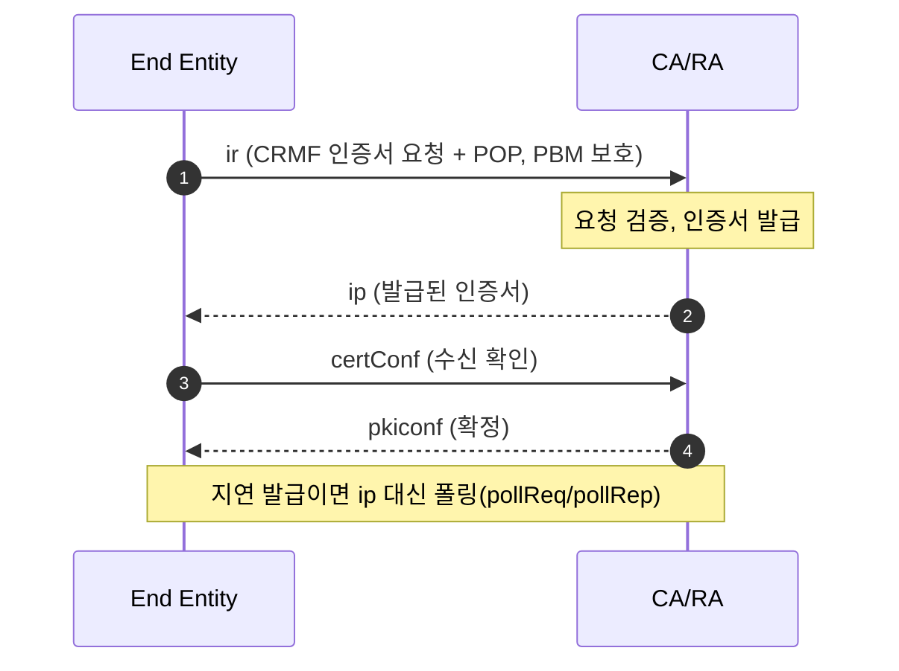

## 1. 개요

**CMP(Certificate Management Protocol)** 는 PKI에서 **X.509 인증서([[x509-certificate]])의 전체 생명주기**(발급·갱신·폐기·키 복구·교차 인증)를 관리하는 IETF 표준 프로토콜이다. 엔드 엔티티(EE)와 CA/RA가 **PKIMessage** 라는 ASN.1 메시지를 주고받으며, 각 메시지는 서명 또는 MAC으로 보호된다.

- 인증서 요청 포맷은 **CRMF(Certificate Request Message Format, RFC 4211)** 를 사용한다(PKCS#10도 지원).
- 인증서 발급뿐 아니라 **CA 인증서 조회·파라미터 협상·CRL 조회** 등 정보성 용도로도 쓴다(§5.5, general message).

### 1.1. RFC 체계

| RFC | 내용 | 비고 |
|---|---|---|
| RFC 2510/2511 | CMPv1 / CRMF (1999) | 구버전 |
| **RFC 4210** | **CMPv2** 본체 (2005) | 오래된 기준 문서 |
| RFC 4211 | CRMF (요청 메시지 포맷) | RFC 9045가 업데이트 |
| RFC 6712 | CMP over HTTP | 전송 |
| RFC 9480 | CMP Updates (2023) | 4210 보완 |
| RFC 9481 | CMP 알고리즘 | |
| RFC 9482 | CMP over CoAP | IoT 전송 |
| RFC 9483 | **Lightweight CMP Profile** | 산업/IoT용 경량 프로파일 |
| **RFC 9810** | **CMPv3** (2025) | 4210+9480 통합, **KEM 키**([[ml-kem]]) 지원 추가 |
| RFC 9811 | HTTP(S) 전송 갱신 | 6712 대체 |

> 새로 구현한다면 **RFC 9810(본체) + RFC 9483(경량 프로파일)** 조합이 현재 기준이다.

---

## 2. 용도·목적

CMP는 인증서 생명주기 전체를 커버한다.

- **초기 등록/발급** — EE가 최초로 인증서를 받음(ir).
- **인증서 요청** — 이미 인증된 EE의 추가 발급(cr, p10cr).
- **키 갱신(rekey)** — 만료 전 새 키쌍으로 갱신(kur).
- **키 복구** — 백업된 개인키/인증서 복구(krr).
- **폐기** — 인증서 폐기 요청(rr).
- **교차 인증** — CA 간 상호 인증서 발급(ccr).
- **정보 조회/협상** — CA 인증서·CRL·요청 템플릿 등 조회(genm, §5.5).

특징:
- **Proof-of-Possession(POP)** — 요청자가 개인키를 실제로 보유함을 증명.
- **확인 절차** — 발급 후 EE가 수신을 확인(certConf) → CA가 최종 확정(pkiconf). 오발급 방지.
- **자동화** — 사람 개입 없이 대량 기기 인증서를 발급·갱신(IoT/산업 환경).

---

## 3. 메시지 구조 (PKIMessage)

모든 CMP 메시지는 ASN.1 DER로 인코딩된 **PKIMessage** 다.

```
PKIMessage ::= SEQUENCE {
    header      PKIHeader,
    body        PKIBody,
    protection  [0] PKIProtection    OPTIONAL,  -- 서명 또는 MAC
    extraCerts  [1] SEQUENCE OF CMPCertificate OPTIONAL  -- 검증용 인증서 체인
}
```

**PKIHeader** (주요 필드):
```
PKIHeader ::= SEQUENCE {
    pvno           INTEGER,             -- 프로토콜 버전(cmp2000 등)
    sender         GeneralName,         -- 송신자
    recipient      GeneralName,         -- 수신자
    messageTime    [0] GeneralizedTime OPTIONAL,
    protectionAlg  [1] AlgorithmIdentifier OPTIONAL,  -- 보호 알고리즘
    senderKID      [2] KeyIdentifier OPTIONAL,
    transactionID  [4] OCTET STRING OPTIONAL,  -- 트랜잭션 상관관계
    senderNonce    [5] OCTET STRING OPTIONAL,  -- 재전송 방지
    recipNonce     [6] OCTET STRING OPTIONAL,
    generalInfo    [8] SEQUENCE OF InfoTypeAndValue OPTIONAL
}
```

- **protection**: 메시지 무결성/인증. **서명**(공개키) 또는 **PBM(Password-Based MAC, 공유 비밀)** 사용.
- **extraCerts**: 서명 검증에 필요한 CA/중간 인증서 동봉.
- **transactionID / nonce**: 요청-응답 상관관계와 재전송(replay) 방지.

---

## 4. 메시지 종류 (PKIBody)

`PKIBody` 는 CHOICE 로, 실제 동작은 **본문 필드 이름**으로 구분한다. 요청 뒤에 응답이 오며, 응답 태그는 주로 `p`로 끝난다(ir→ip, cr→cp, kur→kup).

| 태그 | 요청 → 응답 | 용도 |
|---|---|---|
| `ir` / `ip` | Initialization Req/Resp | 최초 등록·발급 |
| `cr` / `cp` | Certification Req/Resp | 추가 인증서 발급 |
| `p10cr` | PKCS#10 Cert Request | PKCS#10 기반 요청(응답은 cp) |
| `kur` / `kup` | Key Update Req/Resp | 키 갱신(rekey) |
| `krr` / `krp` | Key Recovery Req/Resp | 키/인증서 복구 |
| `rr` / `rp` | Revocation Req/Resp | 폐기 |
| `ccr` / `ccp` | Cross-Cert Req/Resp | 교차 인증 |
| `genm` / `genp` | General Msg/Resp | 정보 조회·협상 |
| `certConf` / `pkiconf` | Cert Confirm / Confirmation | 발급 확인 핸드셰이크 |
| `pollReq` / `pollRep` | Polling Req/Resp | 지연 발급 시 폴링 |
| `error` | Error Message | 오류 통지 |
| `nested` | Nested Message | RA가 메시지 래핑 |
| `popdecc` / `popdecr` | POP Challenge/Resp | 소유 증명 챌린지 |
| `ckuann` / `cann` / `rann` / `crlann` | Announcements | CA 키 갱신·인증서·폐기·CRL 공지 |

---

## 5. 예시

대표 메시지별로 **언제 쓰는지**를 구체적 시나리오와 함께 정리한다.

### 5.1. 초기 발급 — ir/ip

**시나리오**: 공장에서 갓 생산된 IoT 기기가 부팅 시 **사전 공유 비밀(PBM)** 로 최초 인증서를 발급받는다. 아직 키/인증서가 없으므로 서명이 아닌 PBM으로 메시지를 보호한다.



#### 초기 신뢰 확립 — 공유 비밀 배포 vs IDevID 서명

최초 `ir`에는 아직 키/인증서가 없으므로 **최초 인증의 근거를 프로토콜 밖에서 심어야** 한다. 공유 비밀을 CMP in-band(genm/genp 포함)로 교환하는 것은 불가능하다 — 응답을 검증할 수단이 없어 신뢰 부트스트랩이 성립하지 않기 때문(닭-달걀 문제). 두 가지 방식이 있다.

| 방식 | 초기 신뢰 근거 | 배포 경로 |
|---|---|---|
| **PBM(공유 비밀)** | 참조번호 + 비밀값 | **대역 외(out-of-band)** — 프로비저닝/물리 매체/별도 채널 |
| **서명(IDevID)** | 사전 설치 제조사 인증서 | 공장 주입(비밀 교환 불필요) |

- **PBM**: CA/RA가 `참조번호 + 비밀값`을 만들어 대역 외(제조 단계 주입, 스마트카드·출력물, 사내 프로비저닝)로 EE에 전달한다. `ir` 헤더의 `senderKID`에 참조번호를 실어 어떤 비밀을 썼는지 식별하고, 그 비밀로 MAC을 계산해 보호한다.
- **서명(IDevID)**: 기기가 공장에서 **제조사 인증서(IEEE 802.1AR IDevID 등)** 와 개인키를 갖고 출하되면, `ir`을 그 개인키로 서명해 보낸다. 공유 비밀이 아예 불필요하며 IoT/산업 환경에서 권장된다(RFC 9483이 비중 있게 다룸).

> genm/genp는 *이미 신뢰가 선 뒤* CA 인증서·CRL을 받는 용도지, 신뢰를 만드는 용도가 아니다.

### 5.2. 추가 발급 — cr

**시나리오**: 이미 유효한 인증서를 가진 서버가 **다른 도메인/용도의 인증서를 하나 더** 요청한다. 이때는 PBM이 아니라 **기존 인증서의 개인키로 서명**해 메시지를 보호한다(이미 신원이 확립됨). 요청을 PKCS#10으로 만들면 `p10cr` 를 쓴다.

### 5.3. 키 갱신 — kur

**시나리오**: 인증서 만료가 임박해 **무중단 롤오버(rekey)** 한다. 기존(아직 유효한) 인증서의 개인키로 서명해 새 키쌍에 대한 인증서를 요청 → 서비스 중단 없이 새 인증서로 교체. 자동 갱신 파이프라인의 핵심 메시지다.

### 5.4. 폐기 — rr

**시나리오**: 기기가 폐기되거나 **개인키 유출**이 의심될 때, 해당 인증서를 즉시 폐기 요청한다. CA는 폐기 후 CRL/OCSP에 반영한다([[x509-certificate]]).

### 5.5. 정보 조회 — genm/genp

인증서 발급이 아닌 **정보 조회·파라미터 협상** 용도. 본문은 `InfoTypeAndValue`(OID + 값) 리스트다. 사용자가 언급한 "다른 용도"가 여기에 해당한다.

**시나리오**: 기기가 부트스트랩할 때 신뢰할 CA 체인을 모른다 → `genm` 으로 CA 인증서를 조회해 신뢰 저장소를 구성한다.

주요 InfoType:
- **CA 인증서 조회**(`id-it-caCerts`) — 서버가 보유한 CA 인증서 목록 획득.
- **루트 CA 갱신**(`id-it-rootCaCert`/`rootCaKeyUpdate`) — 루트 CA 키 롤오버 정보.
- **인증서 요청 템플릿**(`id-it-certReqTemplate`) — 서버가 요구하는 요청 필드 형식.
- **CRL 조회**(`id-it-crlStatusList`/`currentCRL`) — 최신 CRL 상태·획득.
- **알고리즘/파라미터 협상** — 선호 대칭 알고리즘, 키쌍 타입 등.

> genm/genp 덕분에 CMP는 발급 채널이면서 동시에 **PKI 파라미터 디스커버리 채널**로도 기능한다.

---

## 6. 전송(transport)

CMP는 전송 독립적이며, PKIMessage를 다양한 계층에 실어 나른다.

- **HTTP(S)** — 가장 일반적. `Content-Type: application/pkixcmp` (RFC 6712 → 9811).
- **CoAP(+DTLS)** — 제약 장치/IoT (RFC 9482).
- 기타 — TCP, 파일(FTP/SCP), 이메일(MIME).

---

## 7. 요약

- CMP는 X.509 인증서의 **전 생명주기 관리** 프로토콜(발급·갱신·폐기·복구·교차인증).
- 메시지는 **PKIMessage**(header/body/protection/extraCerts) ASN.1 DER이며, 서명 또는 PBM으로 보호.
- 동작은 **PKIBody CHOICE**의 필드 이름으로 구분: `ir/ip`(초기), `cr/cp`, `kur/kup`, `rr/rp`, `certConf/pkiconf` 등.
- `genm/genp`(general message)로 **CA 인증서·CRL·템플릿 조회** 등 발급 외 용도도 수행.
- 현재 기준은 **RFC 9810(CMPv3)** + **RFC 9483(경량 프로파일)**; KEM 키([[ml-kem]])도 지원.

---

## Sources
- RFC 4210 — CMP(CMPv2): https://www.rfc-editor.org/rfc/rfc4210
- RFC 9480 — CMP Updates: https://www.rfc-editor.org/rfc/rfc9480.html
- RFC 9483 — Lightweight CMP Profile: https://www.rfc-editor.org/rfc/rfc9483.html
- RFC 9810 — CMP(CMPv3): https://www.rfc-editor.org/rfc/rfc9810
- Wikipedia — Certificate Management Protocol: https://en.wikipedia.org/wiki/Certificate_Management_Protocol

---

## Related pages
- [[cmp-bouncycastle]] — BouncyCastle+JCA로 ir/ip 생성·파싱·POP 검증(구현 예시)
- [[x509-certificate]] — CMP가 관리하는 인증서 규격
- [[cms]] — 또 다른 PKCS 계열 메시지 규격(비교)
- [[ml-kem]] — RFC 9810이 지원하는 KEM 키
- [[kdf]] — PBM 보호에 쓰이는 키 유도 맥락
