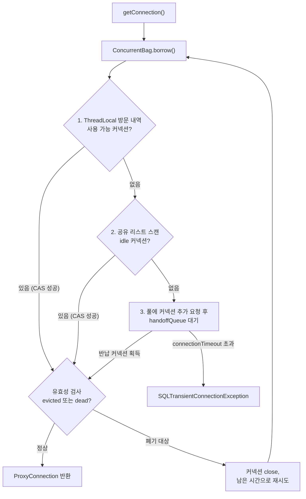
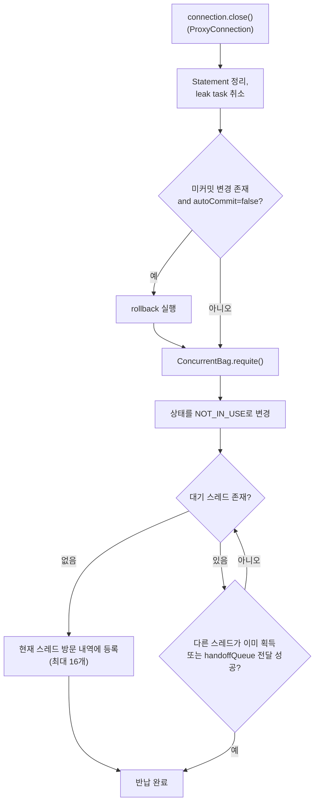

## 1. 개요

HikariCP는 Java JDBC 커넥션 풀 라이브러리로, Spring Boot 2.x부터 기본 DataSource 구현체다. "Fast, simple, reliable"을 표방하며, 라이브러리 크기 ~165KB의 경량 설계가 특징이다. `spring-boot-starter-jdbc` 또는 `spring-boot-starter-data-jpa` 의존성만 추가하면 자동 설정된다.

Spring Boot의 DataSource 자동설정 우선순위:
1. **HikariCP** (최우선)
2. Tomcat pooling DataSource
3. Commons DBCP2
4. Oracle UCP

## 2. 내부 원리

### 2.1. ConcurrentBag

커넥션을 관리하는 핵심 자료구조. ThreadLocal + CopyOnWriteArrayList 기반의 lock-free 컬렉션이다.

- 커넥션 대여 시 현재 스레드의 ThreadLocal 캐시를 먼저 탐색 → 없으면 공유 리스트 탐색 → 없으면 대기
- 락 경합을 최소화해 높은 동시성에서도 오버헤드가 낮다

### 2.2. 커넥션 획득 흐름

`getConnection()`은 `ConcurrentBag.borrow()`를 통해 3단계로 커넥션을 탐색하며, 각 단계에서 CAS(STATE_NOT_IN_USE → STATE_IN_USE) 성공 시 획득한다.

1. **스레드 방문 내역 확인** — 현재 스레드가 이전에 사용한 커넥션(ThreadLocal 캐시) 탐색
2. **전체 풀 스캔** — 공유 리스트에서 idle 상태 커넥션 탐색
3. **handoffQueue 대기** — 풀에 커넥션 추가를 요청(addBagItem)하고 반납 큐에서 대기

획득한 커넥션은 유효성 검사를 거친다. 제거(evict) 표시되었거나 마지막 사용 후 500ms(aliveBypassWindow) 초과 상태에서 죽은 커넥션으로 판정되면 폐기하고 남은 시간으로 처음부터 재시도한다. `connectionTimeout`(기본 30초) 내에 획득하지 못하면 `SQLTransientConnectionException`이 발생한다.



### 2.3. 커넥션 반납 흐름

애플리케이션이 `connection.close()`(ProxyConnection)를 호출하면 실제 소켓을 닫지 않고 풀에 반납한다.

1. **정리** — 열린 Statement를 닫고 누수 감지 태스크 취소. 커밋되지 않은 변경이 있고 autoCommit=false면 rollback 실행
2. **상태 전환** — `ConcurrentBag.requite()`에서 커넥션을 idle(STATE_NOT_IN_USE)로 변경
3. **전달** — 대기 스레드가 있으면 handoffQueue로 전달, 없으면 현재 스레드의 방문 내역(ThreadLocal, 최대 16개)에 등록



### 2.4. 프록시 아키텍처

`Connection`, `Statement`, `ResultSet` 을 프록시로 래핑한다.

- 애플리케이션이 `connection.close()` 호출 → 실제 소켓을 닫지 않고 풀에 반환
- 프록시 레이어에 바이트코드 최적화 적용 → 리플렉션 비용 제거
- Statement 캐시·슬로우쿼리 로그는 의도적으로 미구현 (드라이버 레벨에 위임)

### 2.5. 커넥션 유효성 검사

JDBC4 드라이버의 `Connection.isValid()` 를 자동으로 사용한다. `validationQuery` SQL을 별도로 실행하지 않아 DBCP2 대비 검증 비용이 낮다. non-JDBC4 드라이버는 `connectionTestQuery`에 SQL을 설정한다.

## 3. Spring Boot 설정

### 3.1. application.yml

```yaml
spring:
  datasource:
    url: jdbc:mysql://localhost:3306/mydb
    username: user
    password: secret
    driver-class-name: com.mysql.cj.jdbc.Driver
    hikari:
      pool-name: MyPool
      maximum-pool-size: 10
      minimum-idle: 5
      connection-timeout: 20000
      idle-timeout: 600000
      max-lifetime: 1800000
      keepalive-time: 120000
      leak-detection-threshold: 60000
```

`spring.datasource.hikari.*` 하위 키는 HikariCP 네이티브 프로퍼티명을 kebab-case로 매핑한다.

### 3.2. Java 직접 설정

```java
@Bean
@ConfigurationProperties("spring.datasource.hikari")
public HikariDataSource dataSource() {
    return new HikariDataSource();
}
```

또는 명시적 빌더:

```java
@Bean
public DataSource dataSource() {
    HikariConfig config = new HikariConfig();
    config.setJdbcUrl("jdbc:mysql://localhost:3306/mydb");
    config.setUsername("user");
    config.setPassword("secret");
    config.setMaximumPoolSize(10);
    config.setMinimumIdle(5);
    config.setConnectionTimeout(20_000);
    config.setMaxLifetime(1_800_000);
    config.setPoolName("MyPool");
    return new HikariDataSource(config);
}
```

## 4. 설정 파라미터

### 4.1. 자주 사용하는 파라미터

| 프로퍼티 | 기본값 | 단위 | 설명 |
| :--- | :--- | :--- | :--- |
| `maximumPoolSize` | 10 | 개 | 풀의 최대 커넥션 수 (유휴 + 사용 중 합산) |
| `minimumIdle` | = maximumPoolSize | 개 | 유휴 커넥션 최솟값. HikariCP는 고정 풀 크기를 권장하므로 maximumPoolSize와 동일하게 설정 권장 |
| `connectionTimeout` | 30000 | ms | 풀에서 커넥션을 얻을 때까지 최대 대기 시간. 초과 시 `SQLException`. 최솟값 250ms |
| `idleTimeout` | 600000 | ms | 유휴 커넥션이 풀에서 제거되기까지의 시간. `minimumIdle < maximumPoolSize`일 때만 적용. 0 = 비활성. 최솟값 10000ms |
| `maxLifetime` | 1800000 | ms | 커넥션 최대 수명. 만료 시 풀에서 제거 후 새 커넥션 생성. 0 = 무한(비권장). DB의 `wait_timeout`보다 짧게 설정 |
| `keepaliveTime` | 120000 | ms | 유휴 커넥션에 ping을 보내 유효성 유지. 0 = 비활성. 최솟값 30000ms |
| `poolName` | auto | — | JMX, 로그에서 풀 식별에 사용 |
| `autoCommit` | true | boolean | 커넥션 반환 시 auto-commit 여부 |

### 4.2. 드물게 사용하는 파라미터

| 프로퍼티 | 기본값 | 설명 |
| :--- | :--- | :--- |
| `leakDetectionThreshold` | 0 | ms. 커넥션을 이 시간 이상 보유하면 leak 경고 로그 출력. 0 = 비활성. 최솟값 2000ms. 커넥션 누수 디버깅 시 60000 정도로 설정 |
| `validationTimeout` | 5000 | ms. `isValid()` 타임아웃. 최솟값 250ms |
| `connectionTestQuery` | none | JDBC4 미지원 드라이버 전용 검증 SQL (e.g. `SELECT 1`). JDBC4 드라이버에는 설정하지 말 것 |
| `connectionInitSql` | none | 커넥션 생성 직후 한 번만 실행하는 SQL (e.g. `SET time_zone = '+09:00'`) |
| `transactionIsolation` | 드라이버 기본값 | e.g. `TRANSACTION_READ_COMMITTED` |
| `readOnly` | false | 읽기 전용 커넥션 여부 |
| `initializationFailTimeout` | 1 | ms. 풀 초기화 시 커넥션 확보 대기 시간. 0 = 검증 없이 시작. -1 = 초기화 실패해도 앱 구동 계속 |
| `allowPoolSuspension` | false | JMX로 풀 일시 중단 허용 (HA 시나리오용) |
| `schema` / `catalog` | 드라이버 기본값 | 커넥션의 기본 스키마/카탈로그 |
| `registerMbeans` | false | JMX MBean 등록 여부 |

## 5. Apache DBCP2와의 비교

| 항목 | HikariCP | Apache DBCP2 |
| :--- | :--- | :--- |
| Spring Boot 우선순위 | 1순위 (기본값) | 3순위 |
| 풀 최대 크기 기본값 | `maximumPoolSize` = 10 | `maxTotal` = 8 |
| 유휴 커넥션 제거 | `idleTimeout` + `keepaliveTime` | Eviction thread(`timeBetweenEvictionRunsMillis`) |
| 커넥션 최대 수명 | `maxLifetime` = 1800s | `maxConnLifetimeMillis` = -1 (무한) |
| 커넥션 검증 방식 | JDBC4 `isValid()` 자동 사용 | `validationQuery` SQL 실행 (`testOnBorrow=true` 기본) |
| Statement 풀링 | 없음 (드라이버에 위임) | `poolPreparedStatements` 옵션 |
| 내부 자료구조 | ConcurrentBag (lock-free) | Apache Commons Pool2 `GenericObjectPool` |
| 라이브러리 크기 | ~165KB | 더 큼 |
| 설정 복잡도 | 단순, 핵심 파라미터 소수 | 옵션 다수, 세밀한 제어 가능 |
| 롤백 on return | 수동 설정 | `rollbackOnReturn=true` 기본 |
| 커넥션 재사용 순서 | 내부적으로 최적화 | `lifo=true` (마지막 반환 커넥션 우선) |

### 5.1. 선택 기준

- 신규 Spring Boot 프로젝트: **HikariCP** (기본값, 설정 단순, 성능 우수)
- PreparedStatement 풀링이 드라이버 수준에서 지원되지 않는 레거시 환경: **DBCP2** 검토
- 세밀한 eviction 제어가 필요한 경우: DBCP2의 `numTestsPerEvictionRun`, `softMinEvictableIdleTimeMillis` 등 활용

## 6. 실무 설정 예시

### 6.1. MySQL 연동 권장 설정

```yaml
spring:
  datasource:
    hikari:
      maximum-pool-size: 10
      minimum-idle: 10          # 고정 풀 크기 권장
      max-lifetime: 1800000     # MySQL wait_timeout(기본 8시간)보다 짧게
      keepalive-time: 120000    # 유휴 커넥션 ping
      connection-timeout: 20000
      connection-init-sql: "SET NAMES utf8mb4"
```

### 6.2. 다중 DataSource 환경

[[multi-datasource]] 참고. 각 DataSource 빈에 별개의 `HikariConfig`를 적용하고, `poolName`을 다르게 지정해 JMX 모니터링에서 구분한다.

```java
@Bean(name = "primaryDataSource")
public DataSource primaryDataSource() {
    HikariConfig config = new HikariConfig();
    config.setPoolName("Primary");
    config.setMaximumPoolSize(10);
    // ...
    return new HikariDataSource(config);
}

@Bean(name = "secondaryDataSource")
public DataSource secondaryDataSource() {
    HikariConfig config = new HikariConfig();
    config.setPoolName("Secondary");
    config.setMaximumPoolSize(5);
    // ...
    return new HikariDataSource(config);
}
```

## 7. 기타

- 풀 크기 결정: [[hikari-pool-sizing]] 참고. 시작점 공식 `connections = (core_count × 2) + effective_spindle_count`, 데드락 회피 최소값 `pool_size = Tn × (Cm - 1) + 1`
- 데드락: 발생 메커니즘, 진단, 해결은 [[hikari-deadlock]] 참고
- 커넥션 누수 감지: `leakDetectionThreshold`(4.2 참고) 설정 시 `com.zaxxer.hikari.pool.ProxyLeakTask` 로거에서 WARN 경고 출력

---

## Sources
- [HikariCP GitHub — Configuration](https://github.com/brettwooldridge/HikariCP#configuration-knobs-baby)
- [HikariCP Wiki — About Pool Sizing](https://github.com/brettwooldridge/HikariCP/wiki/About-Pool-Sizing)
- [Spring Boot Reference — Data / SQL](https://docs.spring.io/spring-boot/reference/data/sql.html)
- [Apache Commons DBCP2 Configuration](https://commons.apache.org/proper/commons-dbcp/configuration.html)
- [HikariCP Dead lock에서 벗어나기 (이론·실전편) — 우아한형제들](https://techblog.woowahan.com/2663/)
- [HikariCP — ConcurrentBag.java, HikariPool.java, ProxyConnection.java](https://github.com/brettwooldridge/HikariCP/tree/dev/src/main/java/com/zaxxer/hikari)
- [HikariCP Dead lock에서 벗어나기 (이론편) — 우아한형제들](https://techblog.woowahan.com/2664/)

---

## Related pages
- [[hikari-deadlock]]
- [[multi-datasource]]
- [[routing-datasource]]
- [[externalized-configuration]]
- [[configuration-properties]]
- [[jpa-transaction]]
