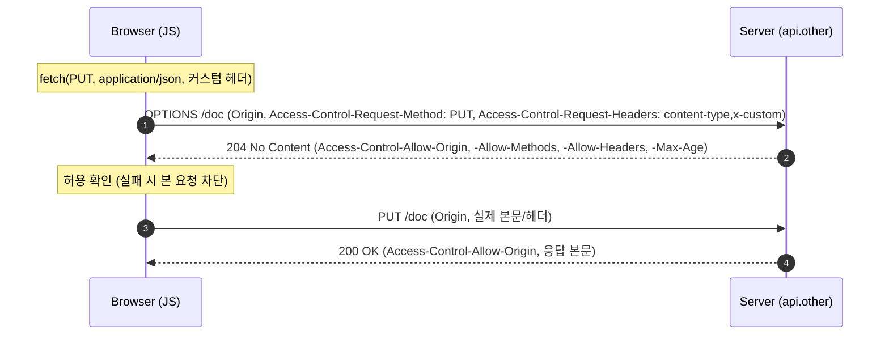

## 1. 개요

**CORS**(Cross-Origin Resource Sharing)는 브라우저가 **다른 origin의 자원 접근을 서버가 HTTP 헤더로 허용(opt-in)**하도록 하는 메커니즘이다. 브라우저의 기본 정책인 **Same-Origin Policy(SOP)**를 표준화된 방법으로 완화한다.

### 1.1. origin이란
**origin = scheme + host + port**. 셋이 모두 같아야 동일 출처다.

```
https://app.example.com:443/page   기준
├─ https://app.example.com/other      ✅ 같은 origin
├─ http://app.example.com             ✗ scheme 다름
├─ https://api.example.com            ✗ host 다름
└─ https://app.example.com:8443       ✗ port 다름
```

---

## 2. 왜 필요한가 (Same-Origin Policy)

브라우저는 보안상 스크립트(`fetch`, `XMLHttpRequest`)가 **다른 origin의 응답을 읽는 것**을 기본 차단한다. SOP가 없으면 악성 사이트의 JS가 사용자가 로그인한 다른 사이트(은행 등)의 데이터를 몰래 읽을 수 있다.

하지만 실무에선 `app.example.com`(프론트)이 `api.example.com`(백엔드)을 호출하는 등 **정당한 교차 출처 요청**이 필요하다. CORS는 서버가 "이 origin은 허용한다"고 **명시적으로 선언**해 SOP를 안전하게 완화하는 장치다.

---

## 3. 자주 하는 오해 ⚠️

CORS는 오해가 특히 많은 주제다.

1. **"CORS가 내 서버를 보호한다"** ✕ CORS는 **브라우저가 강제**하는 클라이언트 측 정책이다. **서버가 아니라 사용자**(다른 사이트에 로그인된 세션·자격)를 보호한다. `curl`·Postman·서버 간 호출은 **CORS를 무시**하고 그대로 요청된다([[curl]]로는 CORS 에러가 안 난다). → **CORS는 서버 인가(authorization)의 대체가 아니다.**

2. **"CORS 에러면 요청이 서버에 도달하지 않았다"** ✕ 단순 요청은 **서버에 도달해 실제로 실행**된다(예: DB에 write까지 일어남). 브라우저가 **응답을 JS에 노출하지 않을** 뿐이다. (프리플라이트가 붙는 요청만 본 요청 전에 차단될 수 있다.)

3. **"CORS = CSRF 방어"** ✕ 서로 다른 문제다. CORS는 오히려 접근을 **완화**하는 쪽이며, CSRF는 별도 방어(토큰·SameSite 쿠키)가 필요하다.

4. **"`Access-Control-Allow-Origin: *` 하나면 다 된다"** ✕ **자격 증명(credentials) 포함 요청**엔 와일드카드 `*`를 쓸 수 없다([§6](#6-자격-증명credentials-규칙)). 또한 `*`는 과도하게 개방적이다.

5. **"프론트엔드 코드로 고친다"** ✕ CORS는 **서버가 응답 헤더를 보내야** 해결된다. 프론트에서 우회할 수 없다(개발용 프록시는 별개).

### 3.1. 왜 server-to-server 요청엔 CORS가 적용되지 않는가

CORS가 서버 간 호출·`curl`에 적용되지 않는 것은 "예외"가 아니라 **CORS의 본질상 당연한 결과**다. 세 가지 이유가 있다.

1. **강제 주체가 브라우저다.** SOP/CORS를 검사·차단하는 코드는 **브라우저(User-Agent) 안에** 구현돼 있다. 서버도 네트워크도 아니다. `curl`, OkHttp/RestTemplate, Node의 서버 사이드 fetch 같은 HTTP 클라이언트는 **SOP를 구현하지 않으므로**, 응답에 `Access-Control-Allow-Origin`이 없어도 그냥 응답을 읽는다. 강제할 주체가 없으면 CORS는 존재하지 않는 것과 같다.

2. **보호할 대상(ambient 자격)이 없다.** CORS가 막으려는 시나리오는 *"사용자가 은행에 로그인한 상태에서 악성 사이트를 열면, 그 사이트의 JS가 브라우저에 저장된 쿠키를 업고 은행 API 응답을 몰래 읽는 것"*이다. 즉 **브라우저에 저장된 사용자 자격(ambient authority)이 자동으로 실리는 것**이 위험의 근원이다. 서버 간 호출엔 그런 사용자 쿠키가 자동으로 붙지 않고, "제3자 페이지에 속은 사용자"라는 구도 자체가 없다. **보호할 대상이 없으니 제약할 이유도 없다.**

3. **origin이라는 개념이 없다.** CORS는 "요청을 보낸 스크립트가 **어느 웹 origin에서 로드됐는가**"를 기준으로 판단한다. 서버 프로세스에는 웹 origin이 없고, `Origin` 헤더도 **브라우저가 자동으로** 붙이는 것이다. 서버 클라이언트는 이를 붙이지 않으며(임의로 넣을 수는 있어도 강제되지 않음), 판단 기준 자체가 성립하지 않는다.

> 그래서 오해 #1처럼 "CORS로 서버를 보호한다"는 착각이 위험하다. 공격자는 브라우저 대신 `curl`이나 서버로 호출하면 CORS를 전혀 거치지 않는다. **서버 보호는 인증/인가로, CORS는 사용자 브라우저 보호로** 역할이 나뉜다.

---

## 4. 동작 — 단순 요청 vs 프리플라이트

### 4.1. 단순 요청 (Simple Request)
아래를 **모두** 만족하면 프리플라이트 없이 바로 전송된다.
- 메서드: **GET / HEAD / POST**
- 안전 헤더(CORS-safelisted)만 사용: `Accept`, `Accept-Language`, `Content-Language`, `Content-Type`, `Range`
- `Content-Type`이 **`application/x-www-form-urlencoded` / `multipart/form-data` / `text/plain`** 중 하나

브라우저가 `Origin` 헤더를 붙여 보내고, 서버가 `Access-Control-Allow-Origin`으로 허용하면 응답이 JS에 노출된다.

### 4.2. 프리플라이트 요청 (Preflighted Request)
위 조건을 벗어나면(PUT/DELETE/PATCH, 커스텀 헤더, `application/json` 등) 브라우저가 **본 요청 전에 OPTIONS 프리플라이트**를 보낸다.



`Access-Control-Max-Age`로 프리플라이트 결과를 캐시하면 반복 OPTIONS를 줄인다.

---

## 5. 헤더 정리

**요청 헤더 (브라우저가 자동 부착)**

| 헤더 | 의미 |
|------|------|
| `Origin` | 요청을 보낸 출처(모든 CORS 요청에 포함) |
| `Access-Control-Request-Method` | (프리플라이트) 본 요청의 메서드 |
| `Access-Control-Request-Headers` | (프리플라이트) 본 요청이 쓸 헤더 목록 |

**응답 헤더 (서버가 설정)**

| 헤더 | 의미 |
|------|------|
| `Access-Control-Allow-Origin` | 허용 origin(`*` 또는 명시 origin) |
| `Access-Control-Allow-Methods` | (프리플라이트) 허용 메서드 |
| `Access-Control-Allow-Headers` | (프리플라이트) 허용 요청 헤더 |
| `Access-Control-Allow-Credentials` | 자격 증명 허용 여부(`true`) |
| `Access-Control-Max-Age` | 프리플라이트 캐시 시간(초) |
| `Access-Control-Expose-Headers` | JS가 읽을 수 있게 노출할 응답 헤더 |

> `Access-Control-Allow-Origin`을 origin별로 다르게 준다면 `Vary: Origin`을 함께 보내 캐시 오염을 막는다.

---

## 6. 자격 증명(credentials) 규칙

쿠키·`Authorization` 헤더를 포함하는 요청(`fetch(..., { credentials: "include" })`, `xhr.withCredentials = true`)엔 특별 규칙이 있다.

- `Access-Control-Allow-Origin`에 **`*` 금지 → 명시적 origin** 필수.
- `Access-Control-Allow-Credentials: true` 필요.
- `Allow-Methods`/`Allow-Headers`에도 `*`를 신뢰하지 않음(명시 필요).

```http
# ✅ 올바름
Access-Control-Allow-Origin: https://app.example.com
Access-Control-Allow-Credentials: true

# ✗ 거부됨 (credentials + 와일드카드)
Access-Control-Allow-Origin: *
Access-Control-Allow-Credentials: true
```

---

## 7. 서버 설정

### 7.1. Spring

**(a) `@CrossOrigin`** — 컨트롤러/메서드 단위
```java
@CrossOrigin(origins = "https://domain2.com", maxAge = 3600)
@RestController
@RequestMapping("/account")
public class AccountController {
    @GetMapping("/{id}")
    public Account retrieve(@PathVariable Long id) { /* ... */ }
}
```
기본값: 모든 origin·헤더·매핑된 메서드 허용, `allowCredentials` 비활성, `maxAge=1800`.

**(b) 전역 설정 — `WebMvcConfigurer`**
```java
@Configuration
public class WebConfig implements WebMvcConfigurer {
    @Override
    public void addCorsMappings(CorsRegistry registry) {
        registry.addMapping("/api/**")
            .allowedOrigins("https://domain1.com", "https://domain2.com")
            .allowedMethods("GET", "PUT")
            .allowedHeaders("header1", "header2")
            .exposedHeaders("header1")
            .allowCredentials(true)
            .maxAge(3600);
    }
}
```

**(c) `CorsFilter` / `CorsConfigurationSource`**
```java
CorsConfiguration config = new CorsConfiguration();
config.setAllowCredentials(true);
config.addAllowedOrigin("https://domain1.com");
config.addAllowedHeader("*");
config.addAllowedMethod("*");

var source = new UrlBasedCorsConfigurationSource();
source.registerCorsConfiguration("/**", config);
CorsFilter filter = new CorsFilter(source);
```

**(d) Spring Security** — MVC 설정을 활용하도록 CORS 활성화
```java
http.cors(withDefaults());   // CorsConfigurationSource 빈을 사용
```

> ⚠️ **`allowCredentials(true)` + `allowedOrigins("*")`는 예외 발생** → **`allowedOriginPatterns("https://*.example.com")`** 를 사용한다.

### 7.2. nginx

```nginx
location /api/ {
    # 프리플라이트: OPTIONS는 여기서 204로 종결(백엔드까지 안 감)
    if ($request_method = OPTIONS) {
        add_header Access-Control-Allow-Origin  "https://app.example.com" always;
        add_header Access-Control-Allow-Methods "GET, POST, PUT, DELETE, OPTIONS" always;
        add_header Access-Control-Allow-Headers "Authorization, Content-Type" always;
        add_header Access-Control-Allow-Credentials "true" always;
        add_header Access-Control-Max-Age 86400 always;
        return 204;
    }

    add_header Access-Control-Allow-Origin  "https://app.example.com" always;
    add_header Access-Control-Allow-Credentials "true" always;

    proxy_pass http://backend;
}
```
- **`always`**: 4xx/5xx 응답에도 헤더가 붙도록 필수.
- **`if` 컨텍스트 주의**: nginx `if` 블록은 바깥 `add_header`를 상속하지 않으므로 블록 안에 다시 선언한다.
- 여러 origin 허용은 `map`으로 `$http_origin`을 검사해 반영한다.

---

## 8. 요약

- CORS = 브라우저의 SOP를 서버 헤더로 완화하는 **opt-in** 메커니즘. origin=scheme+host+port.
- **오해 주의**: 서버가 아니라 사용자 보호 / 요청은 서버에 도달할 수 있음(응답만 차단) / 인가·CSRF 방어의 대체 아님 / `*`는 credentials와 병용 불가 / 서버가 헤더로 해결.
- **server-to-server에 CORS가 없는 이유**: 강제 주체(브라우저)·보호 대상(ambient 자격)·판단 기준(origin)이 모두 없기 때문.
- 단순 요청(GET·HEAD·POST+안전조건)은 프리플라이트 없음, 그 외는 **OPTIONS 프리플라이트**.
- 설정: Spring은 `@CrossOrigin`/`addCorsMappings`/`CorsFilter`+Security `http.cors()`, credentials면 `allowedOriginPatterns`. nginx는 `add_header ... always` + OPTIONS 204.

---

## Sources
- MDN — Cross-Origin Resource Sharing (CORS): https://developer.mozilla.org/en-US/docs/Web/HTTP/Guides/CORS
- Spring Framework Reference — CORS: https://docs.spring.io/spring-framework/reference/web/webmvc-cors.html
- Baeldung — CORS with Spring: https://www.baeldung.com/spring-cors
- enable-cors.org — nginx: https://enable-cors.org/server_nginx.html
- getpagespeed — NGINX CORS: https://www.getpagespeed.com/server-setup/nginx/nginx-cors

---

## Related pages
- [[cookie]] — credentials 요청에 실리는 쿠키의 속성(SameSite 등)
- [[reverse-proxy]] — 프록시 계층에서 CORS 헤더 처리
- [[restful-api-design]] — 교차 출처 API 호출 시 CORS 필요
- [[oauth2]] — 토큰 기반 API 인증(credentials·Authorization 헤더)
- [[curl]] — CORS를 적용받지 않는 클라이언트(오해 검증용)
