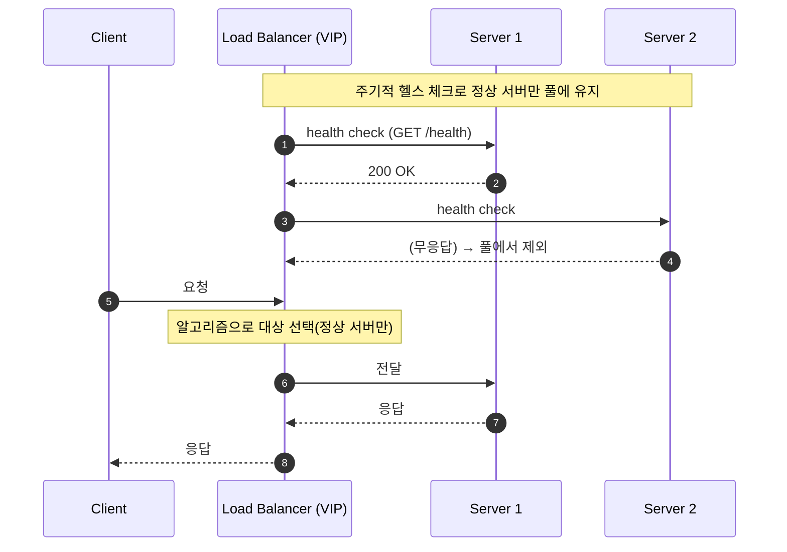

## 1. 개요

**로드 밸런서(Load Balancer, LB)** 는 들어오는 트래픽을 **여러 백엔드 서버로 분산**해, 한 서버에 부하가 몰리지 않게 하고 전체 처리량·가용성을 높이는 장치/소프트웨어다. 클라이언트는 LB의 단일 주소(VIP)로 접속하고, LB가 실제 서버를 골라 전달한다.

주 목적:
- **부하 분산** — 요청을 여러 서버로 나눠 단일 서버 과부하 방지.
- **고가용성(HA)** — 장애 서버를 자동 제외해 무중단 유지.
- **수평 확장(scale-out)** — 서버를 추가하면 그만큼 처리량 증가.

---

## 2. 동작 방식

LB는 서버 풀(pool)을 두고, 각 요청/연결마다 **분산 알고리즘(§4)** 으로 대상 서버를 선택한다. **헬스 체크(health check)** 로 서버 상태를 주기적으로 확인해, 실패한 서버는 풀에서 빼고 정상 복구되면 다시 넣는다.

- **헬스 체크 종류**: L4는 TCP 연결/포트 확인, L7은 `GET /health` 등 응답 코드·본문 검사.

---

## 3. 동작 계층: L4 vs L7

LB가 OSI 어느 계층 정보를 보고 분산하는지에 따라 나뉜다.

| | **L4 (Transport)** | **L7 (Application)** |
|---|---|---|
| 판단 기준 | IP·포트, TCP/UDP | HTTP 헤더·URL·쿠키·본문 |
| 내용 인지 | 패킷 내용 안 봄 | 요청 내용 해석 |
| 라우팅 | 연결 단위 전달 | 경로/호스트/헤더 기반 라우팅 |
| 성능 | 빠름(파싱 없음, 라인레이트에 근접) | 상대적으로 느림(파싱·TLS 종료) |
| 부가 기능 | 단순 전달 | TLS 종료, 콘텐츠 라우팅, 스티키 세션, 압축 |
| 대표 | LVS, AWS NLB, HAProxy(tcp) | nginx, AWS ALB, HAProxy(http), Envoy |

- **L4**: 패킷을 해석하지 않고 그대로 넘기므로 CPU 부담이 적고 처리량이 크다. non-HTTP 프로토콜, 최대 성능이 필요할 때.
- **L7**: 요청을 해석하므로 `/api`→API 서버, `/img`→정적 서버처럼 **내용 기반 라우팅**이 가능하다. HTTP 워크로드 기본 선택. L7 LB는 사실상 [[reverse-proxy]]의 한 형태다.
- **혼합 구조**: 엣지에 L4(대용량 연결·DDoS 흡수), 내부에 L7(라우팅)을 두는 2계층 구성이 흔하다.

---

## 4. 분산 알고리즘

| 알고리즘 | 방식 | 특징/용도 |
|---|---|---|
| **라운드 로빈(Round Robin)** | 서버를 순서대로 순환 배정 | 단순. 서버 성능이 동일하고 요청 비용이 균일할 때 적합 |
| **가중 라운드 로빈(Weighted RR)** | 서버 용량에 비례한 가중치로 배정 | 성능이 다른 서버 혼재 시 |
| **최소 연결(Least Connections)** | 활성 연결이 가장 적은 서버로 | 연결 수명이 제각각(롱 커넥션)일 때 유리 |
| **가중 최소 연결(Weighted LC)** | 가중치 + 활성 연결 함께 고려 | 이기종 서버 + 롱 커넥션 |
| **최소 응답 시간(Least Response Time)** | 응답이 빠른 서버 우선 | 실측 지연 반영 |
| **IP 해시(IP Hash)** | 출발지(+목적지) IP 해시로 서버 결정 | 같은 클라이언트를 같은 서버로(세션 고정 효과). **서버 증감 시 대량 재배치** 발생 |
| **일관성 해시(Consistent Hashing)** | 해시 링에 서버·키 배치 | 서버 증감 시 재배치 최소화. 캐시·샤딩에 필수 |
| **랜덤(Random) / P2C** | 무작위, 또는 둘 뽑아 덜 바쁜 쪽 | 대규모에서 적은 상태로 균형(Power of Two Choices) |

> IP 해시는 서버 대수가 바뀌면 `hash % N`의 N이 변해 거의 모든 매핑이 깨진다. 이를 피하려고 **일관성 해시**를 쓴다.

---

## 5. 장점

- **처리량·확장성** — 요청을 분산해 전체 용량을 서버 대수만큼 확장(scale-out).
- **고가용성** — 헬스 체크로 장애 서버를 자동 우회해 무중단 서비스.
- **유연한 운영** — 무중단 배포(rolling), 서버 추가·제거를 클라이언트 영향 없이 수행.
- **성능 최적화** — L7의 경우 TLS 종료·캐싱·압축·콘텐츠 라우팅으로 백엔드 부담↓.
- **보안** — 백엔드를 직접 노출하지 않고 단일 진입점에서 통제(DDoS 완화 지점).

---

## 6. 배포 형태

- **하드웨어 LB** — F5 BIG-IP, Citrix 등 전용 어플라이언스.
- **소프트웨어 LB** — nginx, HAProxy, Envoy, LVS.
- **클라우드 LB** — AWS ELB(ALB=L7 / NLB=L4), GCP/Azure LB. 관리형·자동 확장.
- **DNS 로드 밸런싱** — DNS 응답으로 여러 IP를 돌려 분산([[dns-configuration]]). 단순하지만 헬스 반영·세밀 제어 약함(캐싱 때문).

---

## 7. 기타

### 7.1. 세션 고정 (sticky session)

**세션 고정(sticky session / session persistence)** 은 특정 클라이언트를 **항상 같은 서버로 보내는** 기능이다. 분산 알고리즘 자체가 아니라, **알고리즘 위에 덧씌워 그 결정을 고정하는 제약**이다.

#### 왜 필요한가 — 세션 저장 위치의 문제

서버가 로그인 상태 등을 **자기 메모리(로컬 세션)** 에 들고 있으면, 다음 요청이 다른 서버로 가면 세션을 못 찾는다. 그래서 "같은 클라이언트 = 같은 서버"로 묶어야 한다. 즉 스티키 세션의 본질은 분산 알고리즘이 아니라 **세션을 어디에 저장하느냐**의 문제다([[session-vs-cookie]]).

#### 알고리즘과의 관계

평소엔 알고리즘(라운드 로빈 등)으로 서버를 고르지만, 스티키가 켜지면 **첫 요청만 알고리즘으로 배정**하고 이후 같은 클라이언트는 그 결정을 고정한다. 구현 방식은 계층에 따라 다르다.

| 방식 | 스티키 실현 | 계층 | 알고리즘과의 관계 |
|---|---|---|---|
| **IP 해시** | 출발지 IP 해시 → 항상 같은 서버 | L4 | 알고리즘 자체가 스티키 효과(둘이 겹침) |
| **쿠키 기반** | LB가 자기 쿠키 삽입, 또는 앱 쿠키(`JSESSIONID`) 읽어 매핑 | L7 | 알고리즘과 독립(예: RR + 쿠키 스티키 병행) |

#### 한계와 대안

스티키 세션은 특정 서버로 트래픽이 쏠리게 하고, 그 서버가 죽으면 묶인 세션이 모두 끊긴다 → 확장·장애 대응에 불리하다. 근본 해결책은 세션을 **Redis 등 외부 저장소로 분리**해 어느 서버로 가든 세션을 공유하게 만들어([[session-vs-cookie]]) 스티키 자체를 불필요하게 만드는 것이다.

### 7.2. 관련 개념

- **리버스 프록시([[reverse-proxy]])** — 백엔드 앞단 대리. L7 LB는 리버스 프록시 기능의 일부. (L7 프록시 ⊃ LB 기능)
- **API 게이트웨이** — LB/프록시 + 인증·레이트리밋·집계 등 API 특화.
- **CDN** — 지리적으로 분산된 엣지 캐시. 글로벌 트래픽 분산에 관여.

---

## 8. 요약

- LB는 트래픽을 **여러 서버로 분산**해 부하 분산·고가용성·수평 확장을 제공한다.
- **L4**(IP·포트, 빠름) vs **L7**(HTTP 내용 기반 라우팅, 기능 풍부)로 계층이 나뉘며, 엣지 L4 + 내부 L7 혼합이 흔하다.
- 알고리즘: 라운드 로빈·가중 RR·최소 연결·IP 해시·일관성 해시 등. 서버 증감이 잦으면 일관성 해시.
- **세션 고정**은 알고리즘이 아니라 세션 저장 위치 문제이며(L4=IP 해시, L7=쿠키 기반), 세션을 외부 저장소로 빼면 불필요해진다.
- **헬스 체크**로 장애 서버를 자동 제외하는 것이 고가용성의 핵심.

---

## Sources
- Cloudflare — Types of load balancing algorithms: https://www.cloudflare.com/learning/performance/types-of-load-balancing-algorithms/
- A10 Networks — Layer 4 vs Layer 7 load balancing: https://www.a10networks.com/glossary/how-do-layer-4-and-layer-7-load-balancing-differ/
- NGINX — HTTP Load Balancing: https://docs.nginx.com/nginx/admin-guide/load-balancer/http-load-balancer/
- AWS — Elastic Load Balancing (ALB/NLB): https://docs.aws.amazon.com/elasticloadbalancing/

---

## Related pages
- [[reverse-proxy]] — 백엔드 앞단 대리, L7 LB의 상위 개념
- [[session-vs-cookie]] — 스티키 세션 vs 외부 세션 저장소(Redis)
- [[dns-configuration]] — DNS 기반 로드 밸런싱
- [[restful-api-design]] — API 게이트웨이/단일 진입점 맥락
