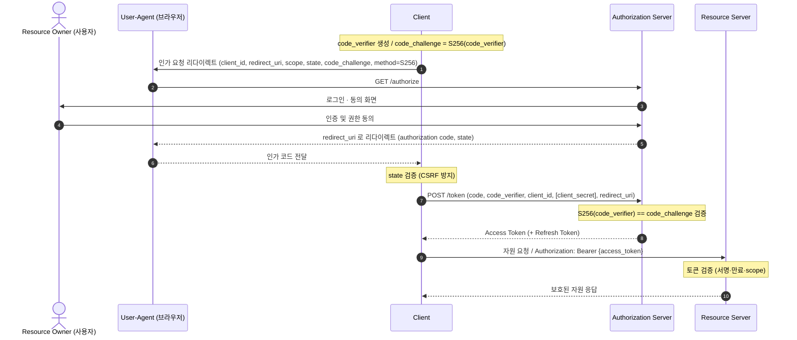
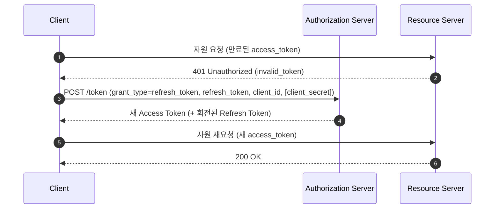

## 1. 개요

**OAuth 2.0**(RFC 6749)은 사용자의 자격증명을 제3자 앱에 넘기지 않고, **제한된 권한(scope)을 위임**해 자원에 접근하게 하는 **인가(authorization) 프레임워크**다. 예: "A 서비스가 내 구글 계정의 프로필만 읽도록 허용" — 이때 A에게 구글 비밀번호를 주지 않는다.

> 주의: OAuth 2.0은 **인가** 프로토콜이지 **인증(로그인)** 프로토콜이 아니다. 사용자 인증·신원 확인은 그 위에 얹은 **OpenID Connect(OIDC)**가 담당한다([§8.1](#81-oauth-20-vs-openid-connect)). 또한 **JWT는 프로토콜이 아니라 토큰 규격**이며 OAuth와 층위가 다르다([§8.2](#82-oauth-20-vs-jwt)).

---

## 2. 역할 (Roles)

| 역할 | 설명 |
|------|------|
| **Resource Owner** | 자원 접근 권한을 가진 주체(보통 사용자) |
| **Client** | 자원 소유자를 대신해 자원에 접근하는 애플리케이션 |
| **Authorization Server (AS)** | 인증·동의 후 토큰을 발급하는 서버 |
| **Resource Server (RS)** | 보호 자원을 호스팅하고 액세스 토큰으로 접근을 허용하는 서버 |

---

## 3. 구성 요소

### 3.1. 클라이언트 타입
- **Confidential** — 자격증명(client_secret)을 안전하게 보관 가능(서버 사이드 앱).
- **Public** — 비밀 보관 불가(SPA, 모바일/네이티브 앱). → **PKCE 필수**.

### 3.2. 엔드포인트
- **Authorization Endpoint** — 사용자 인증·동의를 받는 곳(브라우저 리다이렉트).
- **Token Endpoint** — 인가 코드/리프레시 토큰을 액세스 토큰으로 교환.
- **Redirection Endpoint(redirect_uri)** — AS가 결과를 되돌려주는 클라이언트 주소.

### 3.3. 토큰·파라미터
- **Access Token** — 자원 접근용 자격. 짧은 수명, `scope`로 권한 한정. 보통 `Authorization: Bearer`로 전달(RFC 6750).
- **Refresh Token** — 액세스 토큰 만료 시 재발급용. 선택적, 수명이 김.
- **scope** — 위임 권한 범위. **state** — CSRF 방지 난수. **PKCE**(code_verifier/code_challenge) — 코드 주입 방지.

---

## 4. Grant Type (인가 방식)

| Grant | 용도 | 비고 |
|-------|------|------|
| **Authorization Code (+ PKCE)** | 웹/모바일/SPA 표준 | ⭐ 권장 |
| **Client Credentials** | 서버 간(M2M), 사용자 없음 | |
| **Device Code** | 입력이 제한된 기기(TV, CLI) | |
| **Refresh Token** | 액세스 토큰 재발급 | |
| ~~Implicit~~ | (레거시) 브라우저 앱 | **사용 금지** |
| ~~Resource Owner Password~~ | (레거시) 자격증명 직접 전달 | **사용 금지** |

Implicit·Password는 RFC 9700에서 **폐기/금지**되었다([§7](#7-보안-고려사항)). 오늘날 사용자 로그인 흐름은 사실상 **Authorization Code + PKCE**로 수렴한다.

---

## 5. Authorization Code + PKCE 플로우



**핵심**
- **인가 코드는 브라우저를 거치지만 토큰은 거치지 않는다** — 코드↔토큰 교환은 Client↔AS 백채널 직접 통신.
- Confidential 클라이언트만 `client_secret` 제시(백엔드 보관), Public 클라이언트는 **PKCE로 대체**.

### 5.1. 액세스 토큰 갱신 (Refresh Token)

액세스 토큰은 수명이 짧다. 만료되면 **클라이언트가 refresh_token으로 Authorization Server의 토큰 엔드포인트에 재요청**해 새 토큰을 받는다. 갱신은 **클라이언트의 책임**이며, 리소스 서버나 사용자가 하지 않는다.



- **만료 감지** — ① 선제적: 발급 시 받은 `expires_in`/JWT `exp`로 만료 시각을 추적해 미리 갱신. ② 반응적: 리소스 서버가 `401 Unauthorized`(`invalid_token`)를 반환하면 그때 갱신.
- **갱신 요청 상대** — 리소스 서버가 아니라 **Authorization Server의 토큰 엔드포인트**. 리소스 서버는 토큰 검증만 한다.
- **사용자 개입 없음** — refresh_token이 유효한 동안엔 재로그인 없이 갱신된다(이것이 refresh_token의 존재 이유).
- **Refresh Token Rotation** — 갱신 시 새 refresh_token을 함께 발급하고 이전 것을 무효화한다. 공개 클라이언트는 **회전 또는 sender-constrained MUST**([§7](#7-보안-고려사항)). 무효화된 refresh_token이 재사용되면 탈취로 간주해 토큰 패밀리를 폐기한다.
- **refresh_token 만료·폐기 시** — 갱신이 `invalid_grant`로 실패하므로, 클라이언트는 **처음부터 Authorization Code + PKCE 플로우로 재인증**(사용자 로그인)해야 한다.

---

## 6. PKCE (Proof Key for Code Exchange, RFC 7636)

인가 코드가 탈취되어도 토큰 교환을 막는 확장이다.

1. 클라이언트가 임의의 **`code_verifier`** 생성.
2. **`code_challenge = BASE64URL(SHA-256(code_verifier))`** (method `S256`)를 인가 요청에 포함.
3. 토큰 교환 시 원본 **`code_verifier`**를 제시 → AS가 `S256(code_verifier) == code_challenge`를 검증.

- 탈취자는 `code_verifier`를 모르므로 코드만으로 토큰을 못 받는다 → **코드 가로채기/주입 공격 방어**.
- **모든 클라이언트에 권장**(공개 클라이언트는 **필수**). 단, "PKCE는 클라이언트 인증이 아니며 client_secret의 대체도 아니다" — 둘은 병행한다.

### 6.1. code_verifier / code_challenge

- **`code_verifier`** — 클라이언트가 인가 요청마다 새로 만드는 **고엔트로피 난수 문자열**(예측 불가능한 임시 비밀). RFC 7636 규격: unreserved 문자(`[A-Z][a-z][0-9]-._~`), **43~128자**, 권장 생성법은 **32바이트 이상 난수 → base64url(패딩 없음)**.
- **`code_challenge`** — 난수가 아니라 **`code_verifier`를 해시한 파생값**: `BASE64URL( SHA-256( ASCII(code_verifier) ) )` (해시 대상은 verifier **문자열의 ASCII 바이트**).

**누가 무엇을 보유/전송하는가**

| | 클라이언트 | Authorization Server |
|---|---|---|
| 생성 | code_verifier·code_challenge **둘 다** | — |
| 인가 요청 후 | **code_verifier** 비밀 보관(세션 등) | **code_challenge** 를 인가 코드에 바인딩 저장 |
| 토큰 요청 시 | code_verifier **전송** | 받은 verifier 해시 → challenge와 **대조** |

- 인가 요청 땐 **`code_challenge`만** 전송하고 `code_verifier`는 클라이언트가 보관한다. AS는 이 시점에 `code_verifier`를 모른다.
- **`code_verifier`는 토큰 요청(발급) 단계에서 딱 한 번 전송**되며, AS의 검증도 **바로 그 순간**에 이뤄진다(별도의 나중 검증 시점 없음). 이후 리소스 서버 호출엔 `access_token`만 쓰므로 verifier의 수명은 **인가 요청~토큰 교환**으로 끝난다.

```
[생성]      Client: code_verifier(랜덤) → code_challenge = SHA256(verifier)
[인가요청]  Client --code_challenge--> AS      (AS가 code에 묶어 저장)
[콜백]      AS --authorization code--> Client
[토큰요청]  Client --code + code_verifier--> AS
[검증+발급] AS: SHA256(verifier) == 저장된 challenge ? → 토큰 발급
```

핵심 방어 원리: **AS는 challenge(해시)만 미리 갖고, 원본 verifier는 진짜 클라이언트만 안다.** 코드가 탈취돼도 verifier가 없으면 해시 대조를 통과하지 못한다.

> 실무에선 Spring Security OAuth2 Client, Nimbus, AppAuth 등 라이브러리가 verifier/challenge 생성·검증을 대신 처리한다.

---

## 7. 보안 고려사항

### 7.1. RFC 9700 Security BCP

- **PKCE**: 공개 클라이언트 **MUST**, AS는 PKCE 지원 **MUST**.
- **CSRF 방지**: 클라이언트 **MUST** — PKCE / OIDC `nonce` / `state`에 바인딩된 일회성 토큰.
- **redirect_uri 정확 문자열 매칭**(MUST) — 패턴/부분 매칭 금지(자격 유출 방어). 네이티브 앱 localhost 포트만 예외.
- **Implicit grant 금지**(SHOULD NOT) — 토큰이 URL에 노출됨.
- **Resource Owner Password grant 금지**(MUST NOT) — 자격증명 노출, MFA 불가.
- **Access Token을 URI 쿼리 파라미터로 전달 금지**(MUST NOT) — 브라우저 기록·Referer 유출.
- **Refresh Token**: 공개 클라이언트는 **회전(rotation) 또는 sender-constrained MUST** — 재사용 공격 완화.
- **Mix-up / 코드 주입 방지**: 발급자 식별(`iss`, RFC 9207)·PKCE·`nonce`.
- 추가 실무: 액세스 토큰 **짧은 수명**, 토큰은 안전 저장(§7.2), 전 구간 HTTPS.

### 7.2. 토큰 저장 위치

토큰을 어디에 두느냐는 **클라이언트 타입에 따라 다르며**, "무조건 브라우저 저장"이 아니다. 가장 안전한 방식은 **서버 측 보관**이다. `refresh_token`은 수명이 길고 재발급 권한을 가지므로 `access_token`보다 더 강하게 보호한다.

**(a) 서버 사이드 웹앱 (Confidential) — 서버 보관 ⭐**
- 토큰을 **백엔드(서버 세션·서버 저장소)**에 두고 브라우저에는 **세션 쿠키만** 준다.
- 토큰이 **브라우저 JS에 노출되지 않아** XSS로 탈취 불가 → 가장 안전.

**(b) SPA / 브라우저 (Public) — 트레이드오프**

| 저장소 | 장점 | 위험 |
|--------|------|------|
| `localStorage`/`sessionStorage` | 구현 쉬움, 새로고침 유지 | **XSS에 취약**(주입된 JS가 읽음). refresh_token 저장은 지양 |
| **메모리(JS 변수)** | XSS 지속 탈취 어려움 | 새로고침 시 소실(access_token용) |
| **HttpOnly · Secure · SameSite 쿠키** | **JS가 못 읽음**(XSS 토큰 절도 완화) | **CSRF 방어 필요**(SameSite·CSRF 토큰) |

→ JS 접근 저장소(localStorage)는 **XSS**에, 쿠키는 **CSRF**에 노출된다. 브라우저에 둘수록 공격면이 넓어지므로 가능하면 서버로 밀어낸다.

**(c) 네이티브/모바일 (Public) — OS 보안 저장소**
- iOS **Keychain**, Android **Keystore / EncryptedSharedPreferences**. 평문 파일 저장 금지.

**IETF 권고 아키텍처 (OAuth 2.0 for Browser-Based Apps)**

브라우저 앱은 다음 세 패턴 중 하나를 택하며, **BFF가 강력 권장**된다(특히 민감·업무용 앱).

1. **BFF(Backend-For-Frontend)** ⭐ — 전용 백엔드가 **Confidential 클라이언트**로서 Authorization Code 플로우를 수행하고 **토큰을 서버에 보관**, 브라우저에는 **세션 쿠키만** 발급. 브라우저에 추출할 토큰이 아예 없어 보안이 가장 강함. 모든 자원 요청은 백엔드를 경유.
2. **Token-Mediating Backend** — 백엔드가 OAuth를 처리하되 프론트가 access_token으로 리소스 서버를 직접 호출. 프론트는 토큰을 **localStorage에 저장하지 말고 메모리에만** 두고, 없으면 백엔드에 재요청해야 한다(SHOULD).
3. **Browser-based OAuth Client** — 브라우저가 직접 OAuth 클라이언트로 모든 책임을 진다(가장 노출 큼).

> 요약: **가능하면 BFF로 서버 보관**. 굳이 브라우저에 둔다면 **access_token은 메모리**, refresh_token은 브라우저 저장을 피하거나 HttpOnly 쿠키 + [회전](#51-액세스-토큰-갱신-refresh-token)을 쓴다.

---

## 8. 비교 — 관련 기술과의 구분

OAuth 2.0은 OIDC·JWT와 자주 혼동된다. 각각 **층위와 역할이 다르다.**

### 8.1. OAuth 2.0 vs OpenID Connect

- **OAuth 2.0** = 인가(권한 위임). 액세스 토큰으로 "무엇을 할 수 있는가"를 다룬다.
- **OIDC** = OAuth 2.0 위의 인증 계층. **ID Token(JWT)**으로 "누구인가"(신원)를 다룬다.
- "소셜 로그인"은 대부분 OIDC. OAuth만으로 로그인(인증)을 구현하는 것은 안티패턴이다.

### 8.2. OAuth 2.0 vs JWT

둘은 **층위가 다르다.** JWT는 **데이터 포맷(토큰 규격, RFC 7519)**, OAuth 2.0은 **인가 프레임워크(프로토콜, RFC 6749)**다. JWT 자체의 구조·서명·클레임·보안 상세는 [[jwt]] 참고.

**관계**
- OAuth 2.0의 **액세스 토큰은 opaque(서버 조회형)일 수도 JWT(자기 완결형)일 수도 있다.** JWT로 하면 DB 조회 없이 stateless 검증이 가능하다(RFC 9068: OAuth 액세스 토큰용 JWT 프로파일).
- **OIDC의 ID Token은 항상 JWT다.**
- 반대로 JWT는 OAuth와 무관한 곳(자체 세션 토큰, 서비스 간 주장 전달 등)에서도 쓸 수 있다.

> 요약: **"JWT를 쓴다 ≠ OAuth를 쓴다."** JWT는 봉투(포맷), OAuth는 그 봉투를 주고받는 절차(프로토콜)에 가깝다.

---

## 9. 요약

- OAuth 2.0 = 자격증명 노출 없이 **범위 한정 권한을 위임**하는 인가 프레임워크. 4역할(RO/Client/AS/RS).
- 오늘날 표준 흐름은 **Authorization Code + PKCE**. Implicit·Password는 금지.
- 코드는 브라우저 경유, **토큰은 백채널** 교환. PKCE로 코드 탈취를 무력화.
- 보안 BCP(RFC 9700): PKCE·정확한 redirect_uri 매칭·state/nonce·refresh 토큰 회전·토큰 URL 노출 금지.
- **인증**이 필요하면 OAuth가 아니라 **OIDC**. **JWT**는 프로토콜이 아니라 **토큰 규격**으로, OAuth 토큰 포맷의 한 선택지일 뿐이다.

---

## Sources
- RFC 6749 — The OAuth 2.0 Authorization Framework: https://datatracker.ietf.org/doc/html/rfc6749
- RFC 6750 — Bearer Token Usage: https://datatracker.ietf.org/doc/html/rfc6750
- RFC 7636 — Proof Key for Code Exchange (PKCE): https://www.rfc-editor.org/rfc/rfc7636
- RFC 7519 — JSON Web Token (JWT): https://datatracker.ietf.org/doc/html/rfc7519
- RFC 9068 — JWT Profile for OAuth 2.0 Access Tokens: https://datatracker.ietf.org/doc/html/rfc9068
- RFC 9700 — OAuth 2.0 Security Best Current Practice: https://datatracker.ietf.org/doc/html/rfc9700
- oauth.net — Grant Types / PKCE / JWT: https://oauth.net/2/grant-types/ , https://oauth.net/2/pkce/ , https://oauth.net/2/jwt/
- IETF draft — OAuth 2.0 for Browser-Based Apps (BFF·토큰 저장): https://datatracker.ietf.org/doc/html/draft-ietf-oauth-browser-based-apps

---

## Related pages
- [[jwt]] — JWT 토큰 규격 상세(구조·JWS/JWE·클레임·서명 알고리즘·보안)
- [[restful-api-design]] — REST API 인증/인가(Authorization 헤더·Bearer 토큰)
- [[cors]] — 브라우저 기반 클라이언트의 토큰/쿠키 교차 출처 전송(credentials 규칙)
- [[ldap]] — 디렉터리 기반 인증(LDAP Bind)과의 계층 비교
- [[sso]] — SSO 개념과 SAML 2.0/Kerberos 등 다른 프로토콜과의 비교
