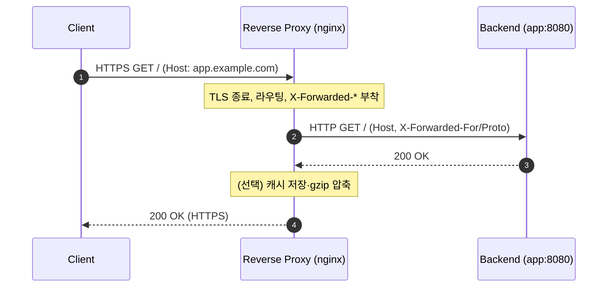

## 1. 개요

**리버스 프록시(Reverse Proxy)**는 **하나 이상의 백엔드(origin) 서버 앞에 위치해 클라이언트의 요청을 대신 받아 백엔드로 전달**하고, 그 응답을 다시 클라이언트에게 돌려주는 서버다. 클라이언트 입장에서는 리버스 프록시가 마치 실제 서버처럼 보이며, 백엔드는 **직접 노출되지 않는다**.

대표 구현: **nginx**, HAProxy, Envoy, Apache httpd(mod_proxy), Traefik, 클라우드 LB.

---

## 2. 포워드 프록시 vs 리버스 프록시

둘 다 "중간에서 대신 요청을 전달"하지만 **누구를 대신하느냐**가 다르다.

| | **포워드 프록시** | **리버스 프록시** |
|---|---|---|
| 위치 | **클라이언트** 앞 | **서버** 앞 |
| 대신하는 대상 | 클라이언트(요청자) | 서버(응답자) |
| 클라이언트 인지 | 프록시를 알고 설정함 | 프록시를 모름(투명) |
| 주 용도 | 사내 아웃바운드 통제, 우회, 익명화, 캐시 | 로드밸런싱, TLS 종료, 캐시, 보호, 라우팅 |

```
[포워드 프록시]  Client → (Forward Proxy) → Internet → Server
[리버스 프록시]  Client → Internet → (Reverse Proxy) → Backend(s)
```

> 요지: 포워드 프록시는 **클라이언트를 위해** 여러 클라이언트의 요청을 밖으로 내보내고, 리버스 프록시는 **서버를 위해** 외부 요청을 받아 백엔드로 넘긴다.

---

## 3. 주요 용도

- **로드 밸런싱** — 여러 백엔드로 요청을 분산해 부하 분산·가용성 확보(한 대 장애 시 우회).
- **TLS 종료(SSL Termination)** — HTTPS 복호화를 프록시가 담당 → 백엔드는 평문 HTTP 처리에 집중, 인증서 관리 일원화.
- **캐싱** — 정적/반복 응답을 캐시해 백엔드 부하↓·응답속도↑.
- **보안/은닉** — 백엔드 IP·구조를 숨기고 직접 노출을 막음, WAF·DDoS 완화 지점.
- **압축·버퍼링** — gzip 등 응답 압축, 느린 클라이언트로부터 백엔드 보호.
- **라우팅/통합** — 경로·호스트별로 다른 서비스로 분배(마이크로서비스 게이트웨이 역할), 단일 진입점.
- **정적 파일 서빙** — 정적 자원은 프록시가 직접 응답, 동적 요청만 백엔드로.

---

## 4. 동작과 전달 헤더

클라이언트 → 리버스 프록시 → 백엔드로 요청이 넘어가면서 **원래 클라이언트 정보가 가려진다.** 백엔드가 실제 클라이언트 IP·프로토콜·호스트를 알려면 프록시가 헤더로 전달해야 한다.

| 헤더 | 의미 |
|------|------|
| `X-Forwarded-For` | 원래 클라이언트 IP(경유 프록시 체인) |
| `X-Forwarded-Proto` | 원래 스킴(http/https) |
| `X-Forwarded-Host` / `Host` | 원래 요청 호스트 |
| `X-Real-IP` | 클라이언트 IP(nginx 관례) |

> 이 헤더를 제대로 넘기지 않으면 애플리케이션의 redirect URL이 내부 포트/HTTP로 깨지는 등의 문제가 생긴다. Spring에서의 처리는 [[forward-headers-proxy]] 참고.



---

## 5. nginx 설정

### 5.1. 기본 프록시
```nginx
server {
    listen 443 ssl;
    server_name app.example.com;
    # ssl_certificate ...;  (TLS 종료)

    location / {
        proxy_pass http://127.0.0.1:8080;

        proxy_set_header Host              $host;
        proxy_set_header X-Real-IP         $remote_addr;
        proxy_set_header X-Forwarded-For   $proxy_add_x_forwarded_for;
        proxy_set_header X-Forwarded-Proto $scheme;
    }
}
```

### 5.2. 로드 밸런싱(upstream)
```nginx
upstream backend {
    # least_conn;            # 부하 분산 전략(기본 round-robin)
    server 10.0.0.11:8080;
    server 10.0.0.12:8080;
    server 10.0.0.13:8080 backup;
}

server {
    location / {
        proxy_pass http://backend;
        proxy_set_header Host $host;
        proxy_set_header X-Forwarded-For $proxy_add_x_forwarded_for;
    }
}
```

### 5.3. 버퍼링 제어
스트리밍·SSE 응답은 버퍼링을 꺼서 즉시 전달한다.
```nginx
location /stream/ {
    proxy_pass http://127.0.0.1:8080;
    proxy_buffering off;      # 즉시 전달(기본 on)
}
```

- 헤더를 비우려면 빈 문자열: `proxy_set_header Accept-Encoding "";`
- CORS를 프록시 계층에서 처리하려면 [[cors]] §7.2 참고.

---

## 6. 인접 개념과 구분

- **로드 밸런서(LB)** — 트래픽 분산에 특화. 리버스 프록시가 LB 기능을 겸하는 경우가 많다(L7 프록시 ⊃ LB 기능).
- **API 게이트웨이** — 리버스 프록시 + 인증/인가·레이트리밋·라우팅·집계 등 API 특화 기능.
- **CDN** — 지리적으로 분산된 캐시형 리버스 프록시(엣지).
- **포워드 프록시** — 클라이언트 측(§2).

---

## 7. 요약

- 리버스 프록시는 **백엔드 앞에서 요청을 대신 받아 전달**하는 서버. 클라이언트에겐 실제 서버처럼 보인다.
- 포워드 프록시(클라이언트 대리)와 반대: 리버스 프록시는 **서버 대리**.
- 용도: 로드밸런싱·TLS 종료·캐싱·보안 은닉·압축·라우팅·정적 서빙.
- 백엔드가 원 클라이언트 정보를 알려면 **`X-Forwarded-*` 전달** 필수([[forward-headers-proxy]]).
- nginx는 `proxy_pass` + `proxy_set_header`(+`upstream`)로 구성.

---

## Sources
- NGINX Admin Guide — Reverse Proxy: https://docs.nginx.com/nginx/admin-guide/web-server/reverse-proxy/
- Cloudflare — What is a reverse proxy?: https://www.cloudflare.com/learning/cdn/glossary/reverse-proxy/
- Kemp — Forward Proxy vs Reverse Proxy: https://kemptechnologies.com/blog/forward-proxy-vs.-reverse-proxy-differences-and-similarities

---

## Related pages
- [[load-balancer]] — 트래픽 분산 특화(L7 LB ⊂ 리버스 프록시 기능)
- [[forward-headers-proxy]] — 리버스 프록시 뒤 X-Forwarded-* 처리(Spring redirect 문제)
- [[cors]] — 프록시 계층에서의 CORS 헤더 처리
- [[restful-api-design]] — API 게이트웨이/단일 진입점 맥락
- [[ssr-vs-csr]] — SSR 앞단 리버스 프록시 캐싱·TLS 종료
- [[curl]] — 프록시 경유 요청/헤더 진단
