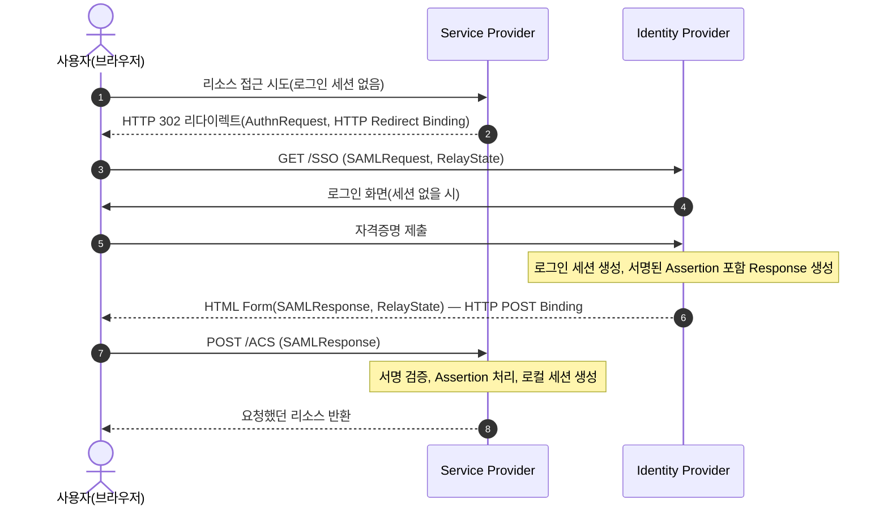

## 1. 개요

**SSO**(Single Sign-On)는 사용자가 한 번 인증하면, 이후 여러 독립된 서비스(애플리케이션)에 재로그인 없이 접근할 수 있게 하는 인증 모델이다. 각 서비스가 사용자 자격증명을 직접 확인하는 대신, 신원을 보증하는 별도 주체를 신뢰한다 — 이를 **연합 신원(federated identity)**이라 한다.

핵심은 인증(누구인지 확인)과 개별 서비스 접근을 분리하는 것이다. 사용자는 **한 곳에서만 인증**하고, 그 인증 결과(assertion·ticket·token)를 여러 서비스가 신뢰해 세션을 만든다.

---

## 2. 핵심 모델

| 역할 | 설명 |
|---|---|
| **IdP**(Identity Provider) | 사용자를 인증하고 신원 정보를 발급하는 주체 |
| **SP**(Service Provider) / **RP**(Relying Party) | IdP가 발급한 신원 정보를 신뢰해 접근을 허용하는 서비스. SAML은 SP, OIDC는 RP로 부름 |
| **신뢰 관계(trust)** | IdP와 SP/RP가 사전에 맺어둔 관계(인증서 교환, 클라이언트 등록 등). 신뢰 관계가 없으면 발급된 신원 정보를 검증할 수 없음 |

웹 기반 SSO의 세션 흐름은 시작 지점에 따라 두 가지로 나뉜다(SAML·OIDC 공통 개념).

- **SP-initiated** — 사용자가 SP 리소스에 먼저 접근 시도 → 로그인 세션이 없으면 SP가 IdP로 리다이렉트 → 인증 후 IdP가 사용자를 SP로 되돌려보냄
- **IdP-initiated** — 사용자가 IdP에 이미 로그인된 상태에서 SP로 가는 링크를 클릭 → IdP가 신원 정보를 만들어 SP로 바로 전달

---

## 3. SAML 2.0

### 3.1. 구성 요소

| 구성 | 내용 |
|---|---|
| **Assertion** | IdP가 발급하는 XML 문서. Authentication(인증 사실)·Attribute(속성)·Authorization Decision(인가 결정) 3종 statement를 담음 |
| **Protocol** | Assertion을 주고받는 요청/응답 규약. 대표적으로 Authentication Request Protocol(인증 요청), Single Logout Protocol(단일 로그아웃) |
| **Binding** | Protocol 메시지를 실제 전송 프로토콜에 얹는 방법. HTTP Redirect, HTTP POST, HTTP Artifact, SOAP 등 |
| **Profile** | Assertion·Protocol·Binding을 특정 시나리오에 맞게 조합한 것. 대표적으로 **Web Browser SSO Profile** |

### 3.2. SP-initiated SSO(Redirect/POST Binding)

- SP는 최초 요청 URL을 로컬 상태로 저장해두고, IdP를 거쳐 돌아온 뒤 **RelayState**로 원래 리소스 위치를 복원한다.
- AuthnRequest(SP→IdP)에는 Redirect/POST/Artifact Binding을, Response(IdP→SP)에는 POST/Artifact Binding을 쓸 수 있으며 양쪽 Binding을 다르게 조합할 수 있다.
- POST Binding으로 전달되는 Assertion은 **반드시 전자서명**되어야 한다.

### 3.3. IdP-initiated SSO(POST Binding)

사용자가 IdP에 이미 로그인된 상태에서 IdP가 제공하는 SP 바로가기 링크를 클릭하면, SP로의 AuthnRequest 없이 IdP가 곧바로 서명된 Assertion을 담은 Response를 SP로 보낸다. SP-initiated보다 설정(IdP에 SP별 링크 등록)이 더 필요하지만, IdP 포털에서 여러 SP로 바로 이동하는 구성에 유용하다.

### 3.4. Single Logout(SLO)

SSO로 여러 SP에 세션이 걸린 상태에서, 한 SP(또는 IdP)가 로그아웃을 시작하면 IdP가 나머지 모든 SP에 `LogoutRequest`를 전달해 근사-동시 로그아웃을 수행한다. 브라우저 쿠키 접근이 필요해 SOAP 같은 동기 백채널보다 **HTTP Redirect/POST 같은 프론트채널 바인딩이 선호**되지만, 사용자가 중간에 브라우저를 이탈하면 일부 SP는 로그아웃되지 않을 수 있어 완전한 보장은 어렵다.

---

## 4. OpenID Connect(OIDC)

OIDC는 **OAuth 2.0 위에 얹은 인증 계층**이다. OAuth 2.0만으로는 "무엇을 할 수 있는가"(인가)만 다루고 "누구인가"(인증)를 표준화하지 않는데, OIDC가 이를 채운다. OAuth2 자체의 역할·플로우·PKCE·보안 고려사항은 [[oauth2]] 참고.

| 용어 | 의미 |
|---|---|
| **OP**(OpenID Provider) | OIDC를 구현한 OAuth 2.0 Authorization Server |
| **RP**(Relying Party) | OIDC를 사용하는 OAuth 2.0 Client |
| **ID Token** | 인증 사실을 담은 JWT. OIDC가 OAuth2에 추가하는 핵심 산출물 |

인증 요청 시 `scope`에 `openid`를 포함하면 OIDC 플로우가 시작되고, 토큰 엔드포인트 응답에 Access Token과 함께 **ID Token**이 포함된다.

**ID Token 주요 클레임**(모두 JWT 클레임, 상세 구조는 [[jwt]] 참고)

| 클레임 | 필수 여부 | 의미 |
|---|---|---|
| `iss` | REQUIRED | 발급자(OP) Issuer Identifier |
| `sub` | REQUIRED | 사용자를 나타내는 Subject Identifier |
| `aud` | REQUIRED | 대상 RP의 client_id |
| `exp` / `iat` | REQUIRED | 만료 시각 / 발급 시각 |
| `auth_time` | 조건부 REQUIRED | 실제 인증이 이뤄진 시각 |
| `nonce` | OPTIONAL | 인증 요청 값과 대조해 리플레이 방지 |
| `acr` / `amr` | OPTIONAL | 인증 컨텍스트 등급 / 사용된 인증 방식(비밀번호, OTP 등) |

ID Token은 **반드시 서명**되어야 하며(JWS), 선택적으로 서명 후 암호화(JWE)할 수 있다. RP는 OP의 설정 정보(엔드포인트 위치, 서명키 등)를 보통 **OpenID Connect Discovery**로 얻는다.

---

## 5. Kerberos

### 5.1. 개념

Kerberos(RFC 4120)는 신뢰할 수 있는 제3자(trusted third party)가 **공유 비밀키 암호화**로 개방된(안전하지 않은) 네트워크에서 신원을 검증하는 프로토콜이다.

- **AS**(Authentication Server) — 클라이언트에게 **TGT**(Ticket-Granting Ticket)를 발급
- **TGS**(Ticket-Granting Server) — TGT를 제시받아 특정 서비스용 **서비스 티켓**을 발급
- **Ticket** — 클라이언트 신원과 세션 키를 담아 서버의 키로 암호화한 자격증명. 서버만 열어볼 수 있음
- **세션 키** — 클라이언트-서버 간 공유되는 임시 키. 이후 통신 인증·암호화에 사용
- **Authenticator** — 클라이언트가 티켓 재사용(replay)을 막기 위해 세션 키로 암호화해 함께 보내는 타임스탬프 포함 정보

AS와 TGS는 프로토콜상 별도 서버로 기술되지만, 실무에서는 하나의 Kerberos 서버(KDC, Key Distribution Center) 안의 서로 다른 엔드포인트로 구현되는 경우가 많다.

### 5.2. SSO로 동작하는 방식

사용자는 로그인 시 **AS에 한 번만 인증**해 TGT를 발급받는다. 이후 다른 서비스에 접근할 때마다 비밀번호를 다시 묻지 않고, 보유한 TGT를 TGS에 제시해 그 서비스 전용 티켓을 받아 접근한다 — 이것이 Kerberos가 SSO로 동작하는 원리다. Windows Active Directory 환경의 도메인 로그인이 대표적인 구현 사례다.

### 5.3. LDAP과의 관계

Kerberos는 **인증 프로토콜**이고 LDAP은 **디렉터리 접근 프로토콜**로 계층이 다르다. Active Directory 등에서는 LDAP 디렉터리가 계정·그룹 정보를 저장하고, Kerberos가 그 계정에 대한 인증을 처리하는 식으로 함께 쓰인다. LDAP 자체의 Bind 인증·구조는 [[ldap]] 참고.

---

## 6. 프로토콜 비교

| | SAML 2.0 | OpenID Connect | Kerberos |
|---|---|---|---|
| 데이터 포맷 | XML(Assertion) | JSON/JWT(ID Token) | 바이너리 티켓(ASN.1) |
| 기반 | 독립 프로토콜 | OAuth 2.0 확장 | 독립 프로토콜(대칭키 기반) |
| 주 전송 | 브라우저 리다이렉트/POST | 브라우저 리다이렉트 + 백채널 토큰 교환 | 네트워크 프로토콜(비-HTTP, 주로 사내망) |
| 주 사용처 | 기업용 웹 SSO(B2B, 엔터프라이즈 SaaS 연동) | 웹/모바일 앱 로그인, 소셜 로그인 | 사내 인트라넷(AD 도메인 로그인) |
| 신원 정보 | 서명된 XML Assertion | 서명된 JWT(ID Token) | 암호화된 티켓 |

---

## 7. 보안 고려사항

- **Assertion/Token 재사용(replay) 방지** — SAML은 `InResponseTo`로 요청-응답 짝을 확인하고 짧은 유효기간(`NotOnOrAfter`)을 둠, OIDC는 `nonce`로 대조, Kerberos는 Authenticator의 타임스탬프로 방지
- **서명·암호화** — SAML Assertion과 OIDC ID Token은 전자서명이 필수이며, 필요 시 암호화까지 적용해 무결성·기밀성을 확보
- **정확한 대상 검증** — SAML은 `Audience`, OIDC는 `aud` 클레임으로 이 토큰이 자신을 대상으로 발급됐는지 반드시 확인
- **세션 고정 방지** — SP/RP는 SSO로 로그인 성공 후 반드시 로컬 세션 식별자를 새로 발급(세션 고정 공격 방어)
- **Single Logout의 한계** — 여러 SP에 걸친 로그아웃은 프론트채널 방식에 의존하는 한 완전한 보장이 어려우므로, 민감한 서비스는 짧은 세션 수명·재인증 정책을 병행

---

## Sources
- OASIS — SAML V2.0 Technical Overview: https://docs.oasis-open.org/security/saml/Post2.0/sstc-saml-tech-overview-2.0.html
- OpenID Foundation — OpenID Connect Core 1.0: https://openid.net/specs/openid-connect-core-1_0.html
- RFC 4120 — The Kerberos Network Authentication Service (V5): https://datatracker.ietf.org/doc/html/rfc4120

---

## Related pages
- [[oauth2]] — OAuth 2.0 인가 프레임워크, Authorization Code+PKCE 플로우
- [[jwt]] — JWT 토큰 규격(ID Token의 기반 포맷)
- [[ldap]] — 디렉터리 접근 프로토콜(Kerberos와 계층 비교)
