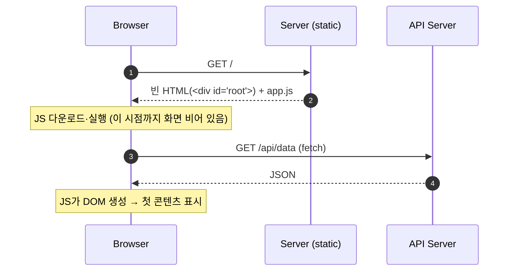
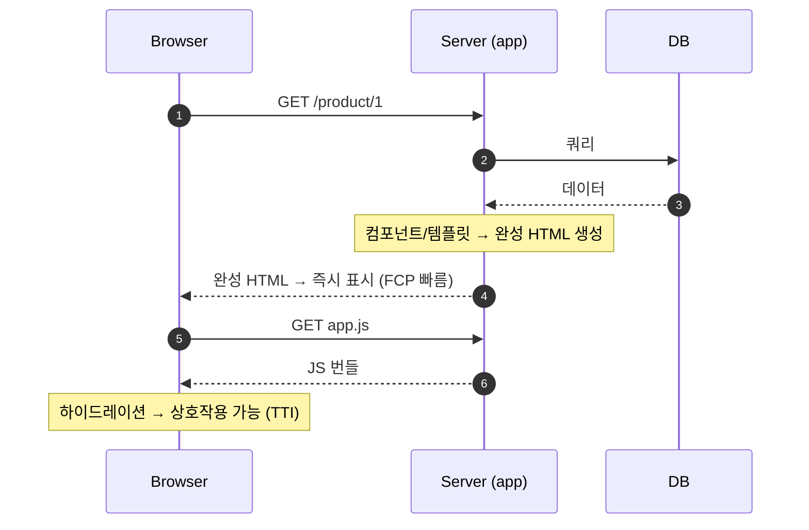

## 1. 개요

**렌더링(rendering)** 은 데이터와 템플릿/컴포넌트를 결합해 최종 HTML(DOM)을 만드는 과정이다. **이 HTML을 어디서 만드느냐** 가 두 방식을 가른다.

- **클라이언트 사이드 렌더링(Client-Side Rendering, CSR)**: 서버는 빈 껍데기 HTML과 자바스크립트(JavaScript) 번들만 주고, 브라우저에서 JS가 DOM을 그린다.
- **서버 사이드 렌더링(Server-Side Rendering, SSR)**: 서버가 요청마다 완성된 HTML을 만들어 응답한다. 브라우저는 곧바로 표시할 화면을 받는다.

---

## 2. CSR

서버 역할은 정적 셸(shell)과 JS 전달로 끝나고, 이후 데이터는 API([[restful-api-design]])로 받아 브라우저가 그린다.

### 2.1. 동작 방식

첫 화면까지 JS 다운로드·실행·데이터 요청이 순차로 필요하다.



### 2.2. 장단점

**장점**
- 서버 부하가 낮다(정적 자원만 서빙, 렌더는 브라우저가 담당).
- 최초 로드 이후 페이지 전환·부분 갱신이 빠르다(SPA 경험).
- 프론트엔드/백엔드 역할 분리가 명확하다(백엔드는 API에 집중).

**단점**
- 첫 콘텐츠 표시(FCP)가 느리다(JS 다운로드·실행 후에야 그림).
- 검색 엔진 최적화(SEO)·소셜 미리보기에 불리하다.
- JS가 꺼지거나 실패하면 아무것도 안 보인다. 번들이 커지기 쉽다.
- 저사양 기기·느린 네트워크에서 체감 성능이 나쁘다.

---

## 3. SSR

서버가 DB 조회·데이터 바인딩 후 HTML 문자열을 만들어 보낸다. 첫 콘텐츠 표시(First Contentful Paint, FCP)가 빠르지만, 상호작용은 이후 JS 로드와 하이드레이션(§3.2)을 거쳐야 가능하다.

### 3.1. 동작 방식



### 3.2. 하이드레이션

**하이드레이션(hydration)** 은 서버가 보낸 **정적 HTML에 클라이언트 JS가 이벤트 핸들러와 상태를 다시 붙여** 살아있는 앱으로 만드는 과정이다. SSR의 핵심 구분점이며, 이 단계가 있어야 SSR로 그린 화면이 실제로 클릭·입력에 반응한다.

#### 왜 필요한가

서버가 보내는 것은 **모양만 있는 HTML** 이다. `onClick` 같은 핸들러, 컴포넌트 상태(state), 이벤트 리스너는 HTML 문자열로 직렬화되지 않는다. 따라서 클라이언트는:

1. 서버가 그린 것과 **동일한 컴포넌트 트리를 다시 렌더링** 하고,
2. 그 결과를 이미 화면에 있는 DOM과 **매칭** 시킨 뒤,
3. 각 DOM 노드에 **이벤트 핸들러·상태를 연결** 한다.

이 동안 화면은 보이지만 아직 반응하지 않는다 → 첫 콘텐츠 표시(FCP)와 상호작용 가능 시점(Time To Interactive, TTI) 사이에 간극이 생긴다. 번들이 크면 이 간극이 커진다(하이드레이션 오버헤드).

#### 코드 예시 (React)

```jsx
// server: 컴포넌트를 HTML 문자열로 렌더 → 응답 본문에 삽입
import { renderToString } from "react-dom/server";
const html = renderToString(<App />);   // <button>0</button> 형태의 정적 HTML

// client: 새로 그리지 않고, 서버 HTML에 "물을 붓는다"
import { hydrateRoot } from "react-dom/client";
hydrateRoot(document.getElementById("root"), <App />);
//         ↑ createRoot(...).render() 와 달리 기존 DOM을 재사용하고 핸들러만 부착
```

`createRoot().render()` 는 DOM을 새로 만들지만, `hydrateRoot()` 는 **기존 서버 DOM을 재사용** 하고 핸들러만 붙이는 것이 차이다.

#### 하이드레이션 불일치 (hydration mismatch)

클라이언트가 다시 렌더한 결과가 서버 HTML과 **다르면** 경고·화면 깨짐이 발생한다. 서버와 클라이언트는 같은 출력을 내야 한다는 전제 때문이다. 대표 원인:

- `typeof window !== 'undefined'` 등으로 서버/클라이언트 분기
- `Date.now()`, `Math.random()` 처럼 매번 값이 달라지는 코드
- `localStorage`([[web-storage]]) 등 브라우저 전용 API를 렌더 중 사용
- 서버와 클라이언트가 **다른 데이터** 를 렌더

#### 개선 기법

- **스트리밍 SSR(streaming)**: HTML을 한 번에 보내지 않고 준비된 조각부터 흘려보내 표시를 앞당김.
- **부분 하이드레이션(partial hydration) / 아일랜드(islands)**: 정적 영역은 두고 상호작용이 필요한 부분만 하이드레이션 → JS 실행량↓.
- **서버 컴포넌트(예: React Server Components)**: 애초에 클라이언트로 JS를 보내지 않는 컴포넌트로 하이드레이션 대상 자체를 줄임.

### 3.3. 두 종류의 SSR

현대 SSR은 하이드레이션 유무로 나뉜다.

- **고전 SSR** — JSP, Thymeleaf, PHP 등 템플릿 엔진. HTML만 주고 하이드레이션이 없다. 페이지 이동 = 전체 새로고침. Spring MVC 기반 전통 웹앱이 여기 속한다. 이벤트는 서버 왕복(폼 전송)이나 별도 스크립트로 처리한다.
- **동형(Isomorphic/Universal) SSR** — Next.js, Nuxt 등. **같은** JS 컴포넌트를 서버에서 1차 렌더하고 클라이언트에서 하이드레이션 → 이후 단일 페이지 애플리케이션(Single Page Application, SPA)처럼 동작한다.

### 3.4. 장단점

**장점**
- 첫 콘텐츠 표시(FCP)가 빠르고, 저사양 기기에서도 유리하다.
- 검색 엔진 최적화(SEO)·소셜 공유 미리보기에 유리하다(완성 HTML 제공).
- 초기 콘텐츠에 필요한 JS 실행량이 적다.

**단점**
- 요청마다 렌더하므로 서버 CPU/메모리 비용과 지연(latency)이 크다.
- 하이드레이션 오버헤드로 FCP와 상호작용 시점(TTI) 사이 간극이 생긴다.
- 캐싱이 복잡하다(사용자별 동적 HTML은 CDN 캐시가 어렵다).
- 렌더 서버 인프라 운영 부담이 있다.

---

## 4. 차이점 요약

| 항목 | CSR | SSR |
|---|---|---|
| HTML 생성 위치 | 브라우저 | 서버 |
| 초기 응답 | 빈 셸 + JS | 완성 HTML |
| 첫 콘텐츠 표시(FCP) | 느림(JS 실행 후) | 빠름 |
| 상호작용 가능(TTI) | 로딩 후 | 하이드레이션 후 |
| 검색 엔진 최적화(SEO) | 불리(크롤러가 JS 실행 필요) | 유리 |
| 서버 부하 | 낮음(정적 서빙) | 높음(요청마다 렌더) |
| 이후 페이지 전환 | 빠름(부분 갱신) | 고전형은 전체 리로드 |

---

## 5. 관련 렌더링 전략 (스펙트럼)

SSR/CSR은 양극단이고, 실무는 그 사이 전략을 페이지별로 **혼합(hybrid)** 한다.

- **정적 사이트 생성(Static Site Generation, SSG)**: 빌드 시점에 HTML을 미리 생성해 CDN에서 서빙. 가장 빠르며 콘텐츠가 거의 변하지 않는 페이지(블로그·문서)에 적합.
- **증분 정적 재생성(Incremental Static Regeneration, ISR)**: SSG + 주기적/온디맨드 재생성. 자주는 아니지만 바뀌는 콘텐츠에 적합.

---

## 6. 대표 기술 스택

| 구분 | 스택 |
|---|---|
| CSR (SPA) | React, Vue, Angular, Svelte |
| 동형 SSR | Next.js(React), Nuxt(Vue), Remix, SvelteKit, Angular Universal |
| 고전 SSR | Spring MVC + Thymeleaf/JSP, Django, Ruby on Rails, Laravel(PHP) |
| 인프라 | SSR 앞단에 [[reverse-proxy]]로 캐싱·TLS 종료·로드밸런싱 |

---

## 7. 요약

- **차이의 본질은 HTML을 만드는 위치**: CSR은 브라우저, SSR은 서버.
- SSR은 첫 콘텐츠 표시(FCP)·검색 엔진 최적화(SEO)에 유리하나 서버 비용이 크고, CSR은 서버 부하가 낮고 전환이 빠르나 초기 로딩·SEO에 불리하다.
- 현대 SSR의 핵심은 **하이드레이션**: 정적 HTML에 JS가 상호작용을 입히는 단계이며, 이 오버헤드가 SSR의 주요 비용이다.
- SSG/ISR을 포함한 스펙트럼에서 페이지별로 전략을 혼합하는 것이 실무 표준이다.

---

## Sources
- MDN — Server-side rendering (SSR): https://developer.mozilla.org/en-US/docs/Glossary/SSR
- React — hydrateRoot: https://react.dev/reference/react-dom/client/hydrateRoot
- Next.js — React hydration error: https://nextjs.org/docs/messages/react-hydration-error
- Vercel — How to choose the best rendering strategy: https://vercel.com/blog/how-to-choose-the-best-rendering-strategy-for-your-app
- Prismic — CSR vs SSR: https://prismic.io/blog/client-side-vs-server-side-rendering

---

## Related pages
- [[restful-api-design]] — CSR이 데이터를 받는 API 설계
- [[reverse-proxy]] — SSR 앞단 캐싱·TLS 종료·로드밸런싱
- [[web-storage]] — 하이드레이션 불일치 원인이 되는 브라우저 저장소
- [[cors]] — CSR에서 API 교차 출처 호출 시
