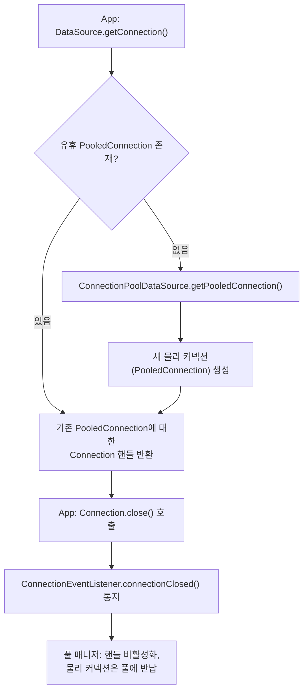
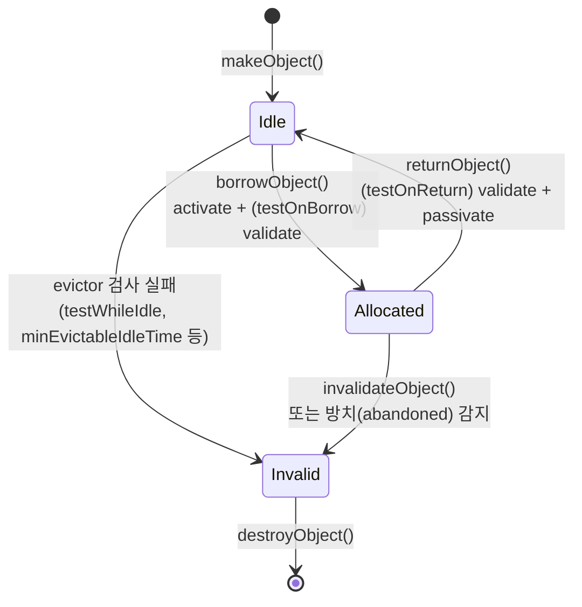

## 1. 개요

### 1.1. 배경
매 요청마다 물리 커넥션을 생성하면 TCP 연결, 인증, DB 세션 초기화 비용이 발생해 지연이 커진다. 커넥션 풀은 미리 생성한 물리 커넥션을 재사용해 이 비용을 줄인다.

### 1.2. 정의
커넥션 풀은 애플리케이션이 커넥션을 반환(`close()`)해도 물리 연결을 끊지 않고 유지했다가 다음 요청에 재사용하는 컴포넌트다. JDBC 4.0(1.4)부터 `javax.sql` 패키지에 풀링을 위한 표준 SPI가 정의되어 있다.

## 2. 원리

### 2.1. DataSource와 커넥션 획득 경로
`DataSource`는 `DriverManager`의 대안으로, 커넥션 획득을 위한 표준 팩토리 인터페이스다. 구현체는 보통 JNDI에 등록해 이름으로 조회하며, Basic(일반 `Connection` 반환) / Connection pooling / Distributed transaction 세 종류로 구분된다.

풀링 구현에서는 `ConnectionPoolDataSource`가 `PooledConnection`의 팩토리 역할을 한다. `PooledConnection`은 물리 커넥션 자체를 표현하며 애플리케이션이 직접 다루지 않고 풀 매니저(미들티어)가 사용한다.

- 풀에 유휴 `PooledConnection`이 있으면 그것에 대한 핸들(`Connection`)을 반환
- 없으면 `ConnectionPoolDataSource.getPooledConnection()`으로 새 물리 커넥션 생성
- 애플리케이션이 `Connection.close()`를 호출해도 실제 소켓은 닫히지 않고 핸들만 비활성화되어 풀에 반납됨
- 물리 연결 종료는 풀 매니저가 `PooledConnection.close()`를 호출할 때만 발생 (서버 종료, 치명적 오류 시)



### 2.2. 이벤트 리스너
풀 매니저는 `PooledConnection.addConnectionEventListener()`로 자신을 등록해 두 이벤트를 통지받는다.
- `connectionClosed` — 애플리케이션이 `Connection.close()` 호출 시
- `connectionErrorOccurred` — 서버 장애 등으로 커넥션을 더 이상 사용할 수 없을 때, 드라이버가 `SQLException`을 던지기 직전에 통지. 풀 매니저는 해당 `PooledConnection`을 풀에서 제거해야 함

JDBC 4.0(1.6)부터는 `addStatementEventListener()`로 `PreparedStatement` 캐싱도 지원한다. 애플리케이션이 `PreparedStatement.close()`를 호출하면 `statementClosed`, 드라이버가 캐시된 statement를 더 이상 쓸 수 없다고 판단하면(예: 백엔드 연결 문제) `statementErrorOccurred`가 통지되어 풀 매니저가 재사용 여부를 결정한다.

### 2.3. 커넥션 상태 모델
범용 오브젝트 풀(Apache Commons Pool2, DBCP2의 기반) 기준으로 설명한다. HikariCP는 activate/passivate 훅 없이 idle/in-use 2단계로 단순화한 자체 구조([[hikari-datasource]] 2.1~2.3 참고)를 쓰지만 개념은 동일하다.

- **idle(유휴)** — 풀에 대기 중, 아직 대여되지 않음
- **allocated(활성)** — 애플리케이션이 대여해 사용 중
- **eviction/validation 검사 중** — 유휴 상태에서 주기적 검사 대상이 되어 큐에서 잠시 제외됨
- **invalid(무효)** — 검사 실패 또는 명시적 무효화로 폐기 대상이 됨

풀은 `PooledObjectFactory`의 라이프사이클 콜백으로 상태를 전이시킨다: `makeObject()`(신규 생성) → `activateObject()`(대여 직전 초기화) → `validateObject()`(대여/반납 시점 유효성 검사) → `passivateObject()`(반납 시 idle 복귀 전 정리, 예: 미종료 트랜잭션 rollback) → `destroyObject()`(물리 연결 종료).



### 2.4. 대여와 풀 소진 처리
- 유휴 인스턴스가 있으면 activate 후 (설정 시) validate하여 반환, 실패하면 폐기하고 다음 유휴 인스턴스 재시도
- 유휴 인스턴스가 없고 현재 대여 수가 `maxTotal` 미만이면 새로 생성
- `maxTotal`에 도달해 풀이 소진되면 `blockWhenExhausted` 설정에 따라 `maxWaitDuration`만큼 대기(초과 시 예외)하거나 즉시 예외
- 재사용 순서는 LIFO(기본, 최근 반납분 우선)/FIFO 선택 가능. 다수 스레드가 대기 중이면 fairness 옵션으로 요청 순서 보장 가능

### 2.5. 유휴 커넥션 관리와 회수
별도 idle object eviction 스레드가 주기적으로(`timeBetweenEvictionRuns`) 유휴 커넥션을 검사한다.
- `testWhileIdle` — 유휴 중에도 주기적으로 validate 실행, 실패 시 폐기
- `minEvictableIdleTime` — 이 시간 이상 유휴 상태인 커넥션을 무조건 폐기
- `softMinEvictableIdleTime` — `minIdle` 개수를 유지하는 조건 하에 유휴 시간 초과 커넥션 폐기(최소 유휴 개수는 보존)
- `minIdle`/`maxIdle` — 유지할 유휴 커넥션의 하한/상한. `addObject()`로 미리 채워 넣어(pre-loading) `minIdle`을 맞출 수 있음

대여된 채 일정 시간 사용도 반납도 되지 않은 커넥션은 `removeAbandonedTimeout` 기준으로 강제 회수 대상이 된다. 회수는 `borrowObject()` 호출 시점(풀 고갈에 가까울 때) 또는 evictor 스레드에서 수행할 수 있다. 커넥션 누수(leak) 탐지·방지에 사용된다.

## 3. 구현체
JDBC 스펙은 SPI만 정의하며 실제 풀 구현은 라이브러리가 담당한다.
- HikariCP — Spring Boot 기본값, ConcurrentBag 기반. 상세는 [[hikari-datasource]]
- Apache Commons DBCP2 — Commons Pool2 `GenericObjectPool` 기반
- C3P0, Tomcat JDBC Pool, Oracle UCP — 레거시·특정 벤더 환경에서 사용

구현체 비교와 선택 기준은 [[hikari-datasource]] 5절 참고.

## 4. 기타

### 4.1. DriverManager와 비교
- `DriverManager.getConnection()` — 호출마다 드라이버가 새 물리 커넥션 생성, URL/계정정보를 코드에 직접 전달, 풀링 없음
- `DataSource` — JNDI 조회로 획득, 속성을 외부에서 변경 가능, 풀링·분산 트랜잭션 구현체와 결합 가능

### 4.2. try-with-resources로 반납 보장
`Connection`은 JDBC 4.1(Java 7)부터 `AutoCloseable`을 구현한다. try-with-resources 구문을 쓰면 예외 발생 여부와 무관하게 블록 종료 시 `close()`가 호출되어 커넥션이 풀에 반납되므로, 명시적 `finally`에서 `close()`를 호출하는 것보다 누수 위험이 낮다.

```java
try (Connection conn = dataSource.getConnection();
     PreparedStatement ps = conn.prepareStatement(sql)) {
    // ...
}
```

---

## Sources
- [PooledConnection (Java SE 21)](https://docs.oracle.com/en/java/javase/21/docs/api/java.sql/javax/sql/PooledConnection.html)
- [ConnectionEventListener (Java SE 21)](https://docs.oracle.com/en/java/javase/21/docs/api/java.sql/javax/sql/ConnectionEventListener.html)
- [ConnectionPoolDataSource (Java SE 21)](https://docs.oracle.com/en/java/javase/21/docs/api/java.sql/javax/sql/ConnectionPoolDataSource.html)
- [DataSource (Java SE 21)](https://docs.oracle.com/en/java/javase/21/docs/api/java.sql/javax/sql/DataSource.html)
- [Connection (Java SE 21)](https://docs.oracle.com/en/java/javase/21/docs/api/java.sql/java/sql/Connection.html)
- [Apache Commons Pool2 — GenericObjectPool](https://commons.apache.org/proper/commons-pool/apidocs/org/apache/commons/pool2/impl/GenericObjectPool.html)
- [Apache Commons Pool2 — PooledObjectFactory](https://commons.apache.org/proper/commons-pool/apidocs/org/apache/commons/pool2/PooledObjectFactory.html)
- [Apache Commons Pool2 — PooledObjectState](https://commons.apache.org/proper/commons-pool/apidocs/org/apache/commons/pool2/PooledObjectState.html)

---

## Related pages
- [[hikari-datasource]]
- [[hikari-deadlock]]
- [[hikari-pool-sizing]]
