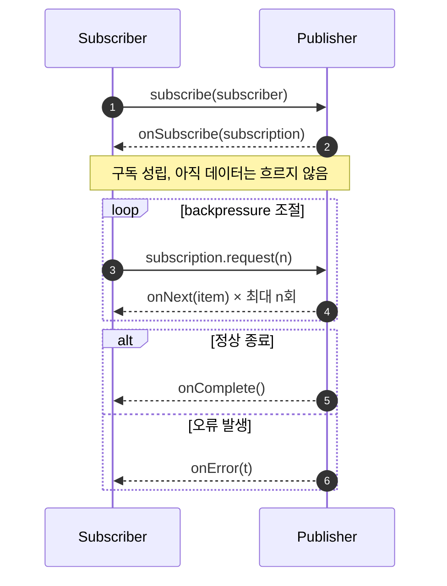

## 1. 개요

리액티브(Reactive) 프로그래밍은 데이터 스트림과 그 변화의 전파를 다루는 비동기 프로그래밍 패러다임이다. 즉 리액티브는 비동기의 하위 개념으로, 비동기 실행 위에 **데이터 스트림을 선언적으로 조합**하는 방법론을 더한 것이다.

모든 비동기 코드가 리액티브는 아니다. 예를 들어 `CompletableFuture`는 비동기 결과를 콜백으로 조합할 수 있지만, 스트림·backpressure 개념이 없어 3장에서 다룰 리액티브의 정의를 충족하지 않는다.

---

## 2. 배경

전통적인 동기 blocking I/O는 요청 하나마다 스레드 하나를 점유하는 thread-per-request 모델을 쓴다. 이 모델은 스레드 수가 늘어날수록 스레드 스택 메모리·컨텍스트 스위칭 비용이 비례해서 늘어나 확장성의 병목이 된다(배경은 [[netty]] 2.1 참고).

I/O-bound 워크로드(외부 API 호출, DB 조회, 네트워크 통신 등)에서는 스레드가 응답을 기다리는 동안 아무 일도 하지 않는 시간이 대부분이다. 이 대기 시간에 스레드를 재사용하려는 시도(콜백 기반 논블로킹)는 있었지만, 콜백만으로 비동기 로직을 조합하면 콜백 지옥·에러 처리 분산 문제가 생겼다. 또한 라이브러리마다 콜백/Future API가 달라 서로 상호 운용되지 않는 문제도 있었다. 리액티브 프로그래밍과 이후의 Reactive Streams 표준은 이 조합·상호운용 문제를 **선언적 연산자 체인 + 공통 인터페이스**로 해결하려는 시도다. CPU-bound와 I/O-bound 워크로드에 따른 대응 전략 차이는 [[tps-improvement]] 참고.

---

## 3. 원리

### 3.1 Observer 패턴의 확장

리액티브 프로그래밍은 Iterator 패턴과 대칭적인 Observer 패턴 위에, 시퀀스를 선언적으로 조합할 수 있는 연산자(map/filter/flatMap 등)를 더한 것이다. Iterable(pull 방식)과 Observable(push 방식)은 동일한 고차 연산자를 대칭적으로 지원한다.

### 3.2 Reactive Streams와 동작 흐름

여러 리액티브 라이브러리 간 상호 운용 문제를 해결하기 위해 **Reactive Streams** 표준이 정의됐다. 핵심 구성 요소는 세 가지다.

| 구성 요소 | 역할 |
|---|---|
| `Publisher` | 항목을 생성하는 생산자 |
| `Subscriber` | 항목을 소비하는 소비자 |
| `Subscription` | Publisher와 Subscriber 사이의 흐름 제어 채널 |

동작 흐름은 다음과 같다.



JDK 9부터는 이 표준 인터페이스를 `java.util.concurrent.Flow`(Publisher/Subscriber/Subscription/Processor)로 내장했다. 최소 구현 예시:

```java
Flow.Publisher<Integer> publisher = ...;
publisher.subscribe(new Flow.Subscriber<>() {
    private Flow.Subscription subscription;

    @Override
    public void onSubscribe(Flow.Subscription subscription) {
        this.subscription = subscription;
        subscription.request(1); // 1개 요청
    }

    @Override
    public void onNext(Integer item) {
        process(item);
        subscription.request(1); // 처리 후 다음 1개 추가 요청
    }

    @Override
    public void onError(Throwable throwable) { /* 에러 처리 */ }

    @Override
    public void onComplete() { /* 종료 처리 */ }
});
```

Subscriber가 처리 속도에 맞춰 `request(n)` 호출 시점·개수를 조절하므로, 순수 push 모델이 **push-pull 하이브리드**로 바뀐다.

### 3.3 Reactive Manifesto: 리액티브 "시스템"

Reactive Streams가 API 수준의 표준이라면, Reactive Manifesto는 시스템 아키텍처 수준의 원칙이다. 네 가지 특성으로 정의된다.

- **Responsive(응답성)**: 가능한 한 시의적절하게 응답한다.
- **Resilient(회복력)**: 장애 상황에서도 응답성을 유지한다.
- **Elastic(탄력성)**: 부하 변화에 따라 자원을 늘리거나 줄여 응답성을 유지한다.
- **Message Driven(메시지 기반)**: 비동기 메시지 전달로 컴포넌트 간 느슨한 결합·격리·위치 투명성을 확보한다.

---

## 4. 장단점

### 4.1 장점

- 적은 스레드로 높은 동시성 처리 → I/O-bound 워크로드에서 스레드 자원 효율과 처리량(TPS) 향상
- backpressure로 생산자가 소비자 처리 속도를 초과해 과부하시키는 상황 방지
- 연산자 체이닝으로 복잡한 비동기 흐름(재시도, 병합, 타임아웃 등)을 선언적으로 표현
- Reactive Streams 표준을 따르는 구현체끼리는 상호 운용 가능

### 4.2 단점

- 로직을 콜백·연산자 체인으로 분해해야 해서, 반복문·try/catch 같은 언어의 기본 순차 제어 구조를 그대로 쓰기 어렵다.
- 디버깅·프로파일링이 어렵다. 스택 트레이스가 실제 호출 경로를 반영하지 못하고, 디버거로 요청 처리 로직을 단계별로 따라가기 힘들다.
- 체인 안에 blocking 호출이 섞이면(6.1 참고) 이벤트 루프 전체가 지연되는 등, 논블로킹 규율이 깨지면 이점이 사라진다.
- CPU-bound 작업에는 이점이 없고 오히려 컨텍스트 전환·연산자 오버헤드만 늘어난다.

---

## 5. 대표 구현체

| 구현체 | 범주 | Reactive Streams 준수 | 특징 |
|---|---|---|---|
| Project Reactor | 라이브러리 | 준수 | `Flux`/`Mono`가 `Publisher`를 직접 구현. Spring WebFlux 기반 |
| RxJava | 라이브러리 | 타입에 따라 다름 | `Observable`(backpressure 미지원, 미준수) vs `Flowable`(준수). Android 생태계에서 널리 사용 |
| `java.util.concurrent.Flow` (JDK 9+) | JDK 내장 표준 | 준수(사양 자체) | Publisher/Subscriber/Subscription/Processor. 구현체가 아닌 SPI |
| Akka Streams | 툴킷 | 준수 | Actor 모델 기반 메시지 구동 애플리케이션 툴킷 |
| Vert.x | 툴킷 | 준수 | 이벤트 루프 기반 polyglot 툴킷, actor 대신 verticle 단위 |

### 5.1 대안: Virtual Threads (JDK 21, Project Loom)

가상 스레드는 리액티브가 풀던 확장성 문제(스레드 수 제한)를, 다수의 가상 스레드를 소수의 OS 스레드에 매핑하는 방식으로 해결하되 코드는 기존과 같은 동기적(thread-per-request) 스타일을 유지한다. 4.2에서 언급한 리액티브 스타일의 디버깅·가독성 단점 없이 비슷한 확장성을 노릴 수 있어, 신규 서버 애플리케이션에서 리액티브 대신 검토되는 대안으로 언급된다.[^1]

---

## 6. 기타

### 6.1 리액티브 ≠ 논블로킹

리액티브(선언적 스트림 조합 + backpressure)와 논블로킹(I/O가 즉시 반환되는 실행 모델)은 서로 다른 층위의 개념이다.[^2] Reactive Streams 스펙이 요구하는 "non-blocking"은 backpressure 신호(`request` 호출) 자체가 블로킹되어서는 안 된다는 뜻이며, 내부 I/O 구현까지 강제하지는 않는다.

- 리액티브 체인 안에서 blocking 호출(예: blocking JDBC)을 하면 코드는 리액티브 스타일이지만 실행은 blocking인 상태가 되어, 그 호출이 이벤트 루프 스레드를 점유해 다른 요청까지 지연시킨다([[netty]] 3.3 참고).
- 반대로 순수 NIO `Selector` + 콜백만으로도 논블로킹은 구현 가능하며, 이 경우 스트림 조합·backpressure는 없다.
- 실무에서는 Reactor/RxJava `Flowable` 등이 Netty 같은 논블로킹 I/O 위에서 동작하도록 설계되어 두 개념이 흔히 함께 묶이지만, 개념적으로는 분리해서 이해해야 한다.

---

## Sources
- [About the Documentation :: Reactor Core Reference Guide](https://projectreactor.io/docs/core/release/reference/aboutDoc.html)
- [The Reactive Manifesto](https://www.reactivemanifesto.org/)
- [ReactiveX — Introduction](https://reactivex.io/intro.html)
- [Reactive Streams JVM specification](https://github.com/reactive-streams/reactive-streams-jvm)
- [java.util.concurrent.Flow (Java SE 21 API)](https://docs.oracle.com/en/java/javase/21/docs/api/java.base/java/util/concurrent/Flow.html)
- [JEP 444: Virtual Threads](https://openjdk.org/jeps/444)
- [Backpressure in ReactiveX/RxJava and difference between Observable and Flowable](https://medium.com/@ajay.dewari/backpressure-in-reactivex-rxjava-and-difference-between-observable-and-flowable-6074c25234ea)
- [Frameworks and toolkits to make Java reactive: RxJava, Spring Reactor, Akka and Vert.x overview](https://www.javacodegeeks.com/2018/08/frameworks-toolkits-make-java-reactive-rxjava-spring-reactor-akka-vert-x-overview.html)

---

## Related pages
- [[netty]]
- [[tps-improvement]]

[^1]: JEP 444 본문의 직접 서술이 아니라, Motivation 절(스레드 수 병목, 리액티브 스타일의 순차 합성 포기·디버깅 도구 한계 서술)과 가상 스레드의 목표(thread-per-request 스타일 유지)로부터 도출한 설명임.
[^2]: 리액티브 시스템 대부분이 논블로킹 I/O 위에서 구현된다는 서술과, Reactive Streams 스펙이 backpressure 신호의 non-blocking만 요구한다는 서술이 출처마다 강조점이 달라(일부는 둘을 사실상 동일시) 정리한 구분임.
