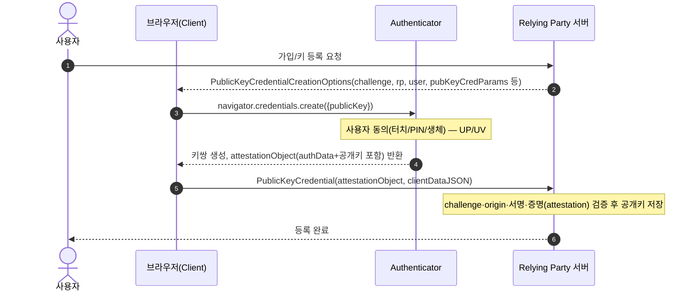
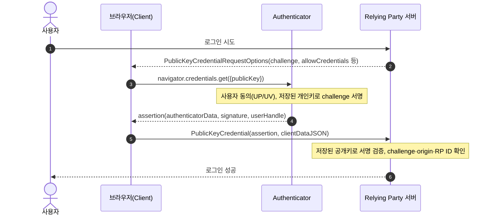

## 1. 개요

**WebAuthn**(Web Authentication API)은 Credential Management API를 확장한 W3C 표준으로, 공개키 암호화를 이용한 강력한 인증을 제공해 패스워드리스 인증과 SMS 없는 **다중 요소 인증**(Multi-Factor Authentication, MFA)을 가능하게 한다.

**FIDO**(Fast IDentity Online) Alliance의 **CTAP**(Client to Authenticator Protocol)와 결합해 FIDO2를 구성하며, WebAuthn은 브라우저(Client)와 웹앱 사이의 API를, CTAP은 Client와 Authenticator(보안키, 플랫폼 생체인증 등) 사이의 통신을 표준화한다. 웹의 Passkey는 WebAuthn 위에 구현된다.

---

## 2. 핵심 용어

| 용어 | 의미 |
|---|---|
| **Relying Party(RP)** | WebAuthn API를 사용해 사용자를 등록·인증하는 서비스(웹앱) |
| **RP ID** | RP를 식별하는 도메인 문자열. 기본값은 origin의 effective domain이며, 그 registrable domain suffix까지만 축소 가능(예: `login.example.com` origin에서 `example.com`은 가능, `com`은 불가) |
| **Authenticator** | 키쌍을 생성·보관하고 서명을 수행하는 암호학적 개체(보안키, TPM, 플랫폼 생체인증 등) |
| **Client** | 브라우저 등 WebAuthn API를 구현하고 Authenticator와의 통신을 중개하는 주체 |
| **Credential Key Pair** | Authenticator가 생성하는 RP별 비대칭 키쌍(개인키는 Authenticator 밖으로 노출되지 않음) |
| **Credential ID** | 특정 키쌍(및 그 어설션)을 식별하는 바이트 시퀀스 |
| **User Handle** | RP가 지정하는 사용자 식별 값(`user.id`). 화면에 노출하지 않는 opaque 값, 최대 64바이트 |
| **UP**(User Presence) | 사용자가 Authenticator와 물리적으로 상호작용했는지(터치 등)에 대한 boolean 결과 |
| **UV**(User Verification) | PIN·생체인증 등으로 사용자를 로컬에서 검증했는지에 대한 결과. UP보다 강한 보장 |
| **Discoverable Credential**(구 resident key) | Authenticator/Client 쪽에 저장되어 `allowCredentials` 없이도 조회 가능한 자격증명 |
| **Non-discoverable Credential**(구 non-resident key) | RP가 `allowCredentials`로 Credential ID를 제시해야 조회 가능. 개인키를 암호화해 Credential ID 자체로 사용하는 방식이 흔함 |

---

## 3. 등록(Registration Ceremony)

**등록**(Registration)은 사용자·RP·Authenticator가 협력해 새 키쌍을 생성하고 RP 계정에 연결하는 절차다. `navigator.credentials.create()`로 시작한다.



### 3.1. `create()`의 `publicKey` 옵션 — `PublicKeyCredentialCreationOptions`

`create()`는 RP 서버가 만들어 전달한 옵션 객체를 받아 Authenticator에 그대로 전달한다. 주요 구성 항목:

| 항목 | 필수 | 의미 |
|---|---|---|
| `challenge` | 필수 | 서버가 생성한 암호학적 난수(최소 16바이트). 재전송(replay) 공격 방지 |
| `rp` | 필수 | `{ id, name }` — RP ID와 표시용 이름 |
| `user` | 필수 | `{ id, name, displayName }` — `id`는 User Handle(바이트열), `name`/`displayName`은 표시용 문자열 |
| `pubKeyCredParams` | 필수 | 허용할 서명 알고리즘 목록 `[{ type: "public-key", alg }]`. `alg`는 COSEAlgorithmIdentifier(예: `-7` = ES256, `-257` = RS256) |
| `timeout` | 선택 | 사용자 응답 대기 제한시간(ms) |
| `excludeCredentials` | 선택 | 이미 등록된 Credential ID 목록. 동일 Authenticator에 중복 등록 방지 |
| `authenticatorSelection` | 선택 | `{ authenticatorAttachment, residentKey, userVerification }` — Platform/Roaming 제한, discoverable credential 요구 여부, UV 요구 수준(§7 참고) |
| `attestation` | 선택 | 증명 전달(Attestation Conveyance) 수준(§6.2 참고) |

RP는 응답 수신 후 다음을 검증한다:
1. `challenge`가 발급한 값과 동일한지
2. `origin`이 예상 origin인지
3. 증명(attestation) 서명 및 인증서 체인이 Authenticator 모델에 맞는지(증명을 요구하는 경우)

---

## 4. 인증(Authentication Ceremony)

**인증**(Authentication)은 사용자가 이전에 등록한 Credential의 개인키를 실제로 보유하고 있음을 RP에게 암호학적으로 증명하는 절차다. `navigator.credentials.get()`으로 시작한다.



### 4.1. `get()`의 `publicKey` 옵션 — `PublicKeyCredentialRequestOptions`

| 항목 | 필수 | 의미 |
|---|---|---|
| `challenge` | 필수 | 서버가 생성한 난수. 등록 때와 동일하게 replay 방지 목적 |
| `rpId` | 선택 | 검증할 RP ID. 생략 시 호출 origin의 effective domain 사용 |
| `allowCredentials` | 선택 | 사용 가능한 Credential ID 목록. 비워두면 discoverable credential 중 해당 RP ID의 것을 Authenticator가 직접 탐색(§8 자동완성 UI에서 활용) |
| `userVerification` | 선택 | `required`/`preferred`/`discouraged` — UV 요구 수준 |
| `timeout` | 선택 | 응답 대기 제한시간(ms) |

RP 검증: 저장된 공개키로 서명 검증 → `challenge` 일치 확인 → RP ID 확인 → `signCount` 비교(§5, 복제 Authenticator 탐지).

---

## 5. Authenticator Data 구조

`authenticatorData`는 37바이트 이상의 바이트 배열로, 등록(§3) 응답의 `attestationObject` 내부와 인증(§4) 응답의 `assertion` 내부 양쪽에 공통 구조로 포함되어 두 ceremony 모두에서 Authenticator가 서명한 대상 데이터의 바탕 구조로 쓰인다.

| 필드 | 길이 | 내용 |
|---|---|---|
| `rpIdHash` | 32B | RP ID의 SHA-256 해시 |
| `flags` | 1B | bit0 UP, bit2 UV, bit6 AT(attestedCredentialData 포함 여부), bit7 ED(extension 포함 여부) |
| `signCount` | 4B | 서명 카운터(32bit 정수) |
| `attestedCredentialData` | 가변 | AT=1일 때만 포함(등록 시). AAGUID + Credential ID + 공개키(COSE_Key) |
| `extensions` | 가변 | ED=1일 때만 포함. CBOR map |

**signCount**는 Authenticator가 Credential별(권장) 또는 Authenticator 전체 단위로 유지하는 카운터다. 등록(§3) 시 초기값이 설정되고, 인증(§4)에 성공할 때마다 증가해 매번 RP에게 새 값이 전달된다. RP는 마지막으로 받은 값을 저장해 두고, 다음 인증에서 받은 값이 저장값보다 작거나 같으면 개인키가 복제된 Authenticator가 존재하거나 오작동 중일 가능성으로 판단한다(클론 탐지). 다만 최신 플랫폼 Authenticator나 동기화되는 Passkey는 이 카운터를 항상 0으로 두는 경우가 많아, 신뢰 판단은 RP의 위험 감수 정책에 맡겨진다.

---

## 6. 증명(Attestation)

**증명**(attestation)은 Authenticator의 출처(제조사·모델)와 그것이 생성한 데이터의 신뢰성을 보증하는 절차로, 등록 시 `attestationObject`에 담겨 전달된다.

### 6.1. 증명 유형(Attestation Type)

WebAuthn은 여러 증명 유형을 지원하며, 각 유형은 신뢰 모델을 정의한다.

| 타입 | 설명 |
|---|---|
| **Basic** | Authenticator 모델(배치) 단위로 공유하는 증명 키(attestation key)로 서명하며, 배치 증명(batch attestation)이라고도 함 |
| **Self** | 별도 증명 키 없이 Credential 개인키로 직접 서명. 보호 수준이 낮은 Authenticator에서 흔함 |
| **AttCA** | TPM 기반. Endorsement Key로 증명 CA(Attestation CA)에 AIK 인증서를 요청하고, 이를 증명 인증서로 사용 |
| **AnonCA** | 익명화 CA(Anonymization CA)가 Credential마다 동적으로 증명 인증서를 발급해 추적을 방지 |
| **None** | 증명 정보 없음 |

### 6.2. 증명 전달(Attestation Conveyance)

`create()`의 `attestation` 옵션(`none`/`indirect`/`direct`/`enterprise`)으로 RP가 증명 요구 수준을 지정한다. 다수의 서비스는 개인정보 보호를 위해 `none`을 사용한다.

---

## 7. Authenticator 분류

Authenticator의 특성은 세 가지 독립적인 기준으로 분류되며, 이 조합이 지원 가능한 사용 사례를 결정한다.

### 7.1. 부착 방식

- **Platform Authenticator** — 기기에 내장되어 분리 불가. 예: 노트북/폰의 Windows Hello, Touch ID, Face ID
- **Roaming Authenticator** — USB/NFC/BLE 등 cross-platform transport로 연결되는 외장형. 여러 기기를 오갈 수 있음. 예: YubiKey 등 FIDO 보안키

### 7.2. 인증 팩터 능력

- **Single-factor capable** — UV(사용자 검증) 미지원, 소유(UP)만 증명. 예: UV 기능이 없는 초기 FIDO U2F 보안키
- **Multi-factor capable** — PIN·생체인증 등으로 UV까지 지원. 예: 지문 센서 내장 보안키, Windows Hello, Face ID

### 7.3. 저장 방식(Discoverable Credential 지원 여부)

- **Discoverable credential capable** — Authenticator/Client 쪽에 Credential을 저장, `allowCredentials` 없이도 조회 가능(Passkey의 필수 조건). 예: 최신 보안키의 resident key 슬롯, 플랫폼 Passkey
- **비지원(구 non-resident 전용)** — 개인키를 암호화해 그 결과를 Credential ID로 사용하고 RP가 이를 보관·제시. 예: 저장 슬롯이 제한적인 구형 FIDO U2F 보안키

### 7.4. 주요 조합 유형

| 조합 유형 | 부착 | 인증 팩터 | 예시 |
|---|---|---|---|
| Second-factor platform authenticator | Platform | Single-factor | 비밀번호 로그인 + 노트북 지문센서를 2차 인증으로 사용 |
| User-verifying platform authenticator | Platform | Multi-factor | 폰의 Face ID 기반 Passkey 로그인(비밀번호 없이) |
| Second-factor roaming authenticator | Roaming | Single-factor | 비밀번호 로그인 + USB 보안키(터치만) 2차 인증 |
| First-factor roaming authenticator | Roaming | Multi-factor | PIN 지원 보안키만으로 비밀번호 없이 로그인 |

---

## 8. 자동완성(Autofill) UI

**자동완성**(Autofill) **UI**는 **조건부 중재**(Conditional Mediation)라고도 하며, 로그인 폼의 username 입력란에 `autocomplete="username webauthn"`을 지정하면 페이지 로드 시 `mediation: "conditional"`로 `get()`을 호출해 사용 가능한 discoverable credential을 브라우저 자동완성에 노출하는 기능이다. `allowCredentials`는 생략하며, 사용자가 필드를 클릭하기 전까지는 대기한다. 비밀번호와 Passkey를 하나의 자동완성 UI로 통합하는 용도로 쓰인다.

```html
<input type="text" name="username" autocomplete="username webauthn" />
```

```js
const supported = await PublicKeyCredential.isConditionalMediationAvailable?.();
if (supported) {
  const assertion = await navigator.credentials.get({
    publicKey: {
      challenge: challengeFromServer, // 서버 발급 난수
      rpId: "example.com",
      userVerification: "required",
      // allowCredentials 생략 — discoverable credential을 자동 탐색
    },
    mediation: "conditional",
  });
  // assertion을 서버로 전송해 §4.1과 동일하게 검증
}
```

---

## 9. 장단점

**장점**
- **피싱 저항** — 서명이 origin에 종속되어, 가짜 로그인 사이트가 정상 사이트로 인증을 재사용할 수 없음
- **유출 피해 감소** — 서버는 공개키만 저장하므로 데이터 유출 시에도 개인키 없이는 인증 불가
- **무차별 대입 내성** — 개인키가 Authenticator 밖으로 노출되지 않아, 전자서명 위조·재사용 공격이 텍스트 비밀번호보다 훨씬 어려움
- **UX 개선** — 생체인증 등과 결합 시 비밀번호 암기·입력이 불필요

**단점**
- Authenticator 분실·기기 변경 시 별도 복구 절차 필요(백업 Authenticator 등록, Passkey 동기화 등)
- 브라우저·OS·Authenticator 조합에 따라 지원 범위가 달라 구형 환경 호환성 이슈 존재
- RP 서버 구현 복잡도 증가(challenge 발급·검증, 증명 검증, 다중 Credential 관리 로직 필요)
- 증명(attestation)을 direct로 요구할 경우 일부 정보 노출 가능(§10 참고)

---

## 10. 보안 고려사항

- **Origin 바인딩** — 서명이 origin/RP ID에 종속되므로 도메인 유사 피싱에 강함
- **Signature Counter** — §5 참고. Authenticator별 카운터를 권장(전역 카운터는 RP 간 추적 handle이 될 수 있어 프라이버시상 불리)
- **증명(attestation)과 프라이버시** — Basic/AttCA/AnonCA는 증명 인증서를 통해 Authenticator 모델을 노출할 수 있어, RP가 allowlist 유지 목적으로 사용하는 것은 권장되지 않음
- **RP ID 완화 범위** — origin의 registrable domain suffix까지만 허용되며 scheme은 반드시 `https`
- **Challenge** — 최소 16바이트의 암호학적 난수 필요. 재사용 시 재전송(replay) 공격에 노출

---

## 11. 기타

### 11.1. 구현 예시

Java 구현 예시는 [[webauthn-java]] 참조.

### 11.2. 서비스 제공자

- **플랫폼 제공자** — OS/브라우저 내장 Passkey 관리자. Apple(iCloud Keychain), Google(Google Password Manager), Microsoft(Windows Hello)
- **서드파티 비밀번호 관리자** — 1Password, Dashlane 등이 브라우저 확장으로 Passkey를 저장·동기화
- **IdP/IAM 벤더** — Okta, Cisco Duo 등이 WebAuthn을 MFA·패스워드리스 인증 수단으로 통합 지원
- **하드웨어 보안키 제조사** — Yubico(YubiKey), Feitian 등 FIDO2 인증 Authenticator 공급
- **Passkey 전용 서비스(BaaS)** — Corbado, Hanko(FIDO2 인증 passkey 서버·SDK), Passage by 1Password 등 RP가 자체 인프라 없이 Passkey 인증을 도입할 수 있도록 지원

---

## Sources
- W3C — Web Authentication: An API for accessing Public Key Credentials, Level 2: https://www.w3.org/TR/webauthn-2/
- MDN — Web Authentication API: https://developer.mozilla.org/en-US/docs/Web/API/Web_Authentication_API
- FIDO Alliance — FIDO Specifications Overview (CTAP/WebAuthn 관계): https://fidoalliance.org/specifications/
- Okta Developer — Web Authentication integration guide: https://developer.okta.com/docs/guides/authenticators-web-authn/main/
- Cisco Duo — Duo Passwordless: https://duo.com/docs/passwordless
- Corbado — Passkeys explained clearly: https://www.corbado.com/blog/passkeys-explained-clearly
- Hanko — FIDO2-certified passkey server and SDKs (GitHub): https://github.com/teamhanko/passkeys

---

## Related pages
- [[webauthn-java]] — Java(java-webauthn-server)·Spring Security 등록·인증 구현 예시
- [[sso]] — SSO 모델과의 관계(별도 인증 팩터로 결합 가능)
- [[x509-certificate]] — 증명 인증서(attestation certificate)의 기반인 X.509 구조·검증
- [[cookie]] — Credential Management API가 확장하는 기반, 세션 유지 수단 비교
- [[session-vs-cookie]] — HTTP 상태 유지 수단 비교
